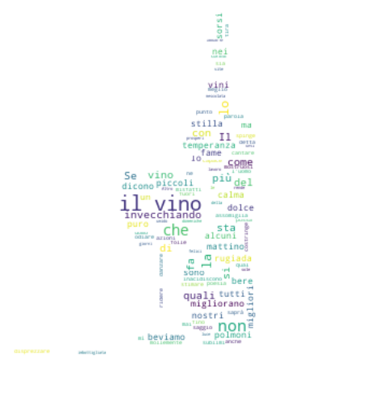
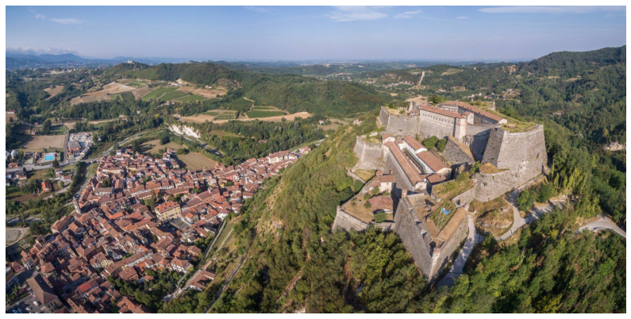
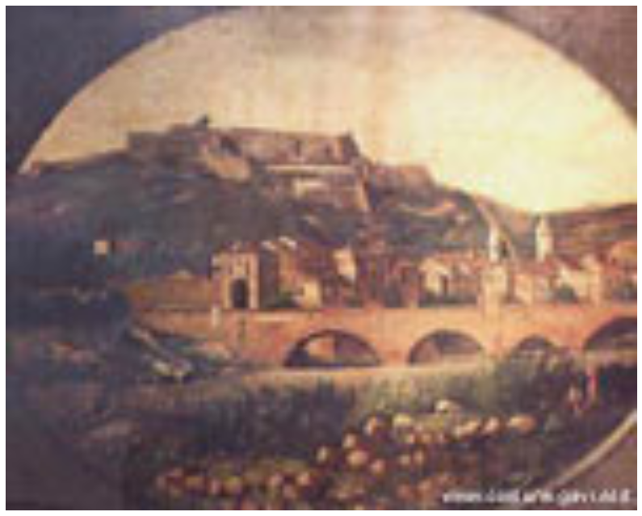

# GAVI


### Introduzione

In questa esercitazione di "Data Visualization", vi propongo una piccola giuda interattiva di Gavi che, a mio parere, è un piccolo gioiello del basso Piemonte! Qui potrete perdervi tra le stradine del paese e assaggiare i cibi tipici della tradizione piemontese/genovese. Oppure, potete percorrere quello che io chiamo "passeggiata del vino" tra le aziende vinicole (e vi consiglio di farla rigorosamente a piedi o in bici per godervi meglio il paesaggio). Le mie preferite sono le strade che passano da Monterondo o della Lomellina che, in determinati periodi dell'anno (marzo/aprile o settembre/ottobre) sono, a mio parere, uno splendore perchè si riempono di colore grazie ai vigneti! Ma vi consiglio anche di partecipare agli eventi proposti sul sito di Gavi (tra cui **Di Gavi in Gavi**, sito:http://www.comune.gavi.al.it/default.asp). Inoltre, grazie all'aiuto di Google, vi ho riporto l'elenco delle principali aziende vinicole, ristoranti, bar, b&b, hotel e agriturismi.

La giuda è così composta:

- **Dove si trova?**
- **Avvenimenti storici**
- **Monumenti**
- **Gastronomia e Vini** (suddivisa ulteriormente in: **Vini, Gastronomia, Dolci**, con rispettive mappe e elenchi)
- **Dove dormire**

Detto questo, vi auguro una buona Lettura!


PS: Rimango a vostra disposizione per eventuali suggerimenti di miglioramento.


<details>
  <summary>👀 Espandi il codice</summary>

```python
import numpy as np
import pandas as pd
import matplotlib.pyplot as plt
from PIL import Image
from pylab import *
#!pip install folium
import folium
from folium import plugins
#!pip install xlrd
import xlrd   #read file excel
from wordcloud import WordCloud, STOPWORDS
```
</details>

<details>
  <summary>👀 Espandi il codice</summary>

```python
# Create Mask Wine
wine_mask = np.array(Image.open("Icon_vino.jpg", 'r'))


# open wine.txt
wine_novel = open('wine.txt').read()
stopwords = STOPWORDS

#Word Cloud wine
wine_wc = WordCloud(background_color='white', max_font_size = 88, max_words=3000, mask=wine_mask, stopwords=stopwords).generate(wine_novel)
#wine_wc.recolor(color_func = grey_color_func)
fig = plt.figure()
fig.set_figwidth(8)  # set width
fig.set_figheight(10)  # set height


plt.imshow(wine_wc, interpolation='bilinear')
plt.axis('off')
plt.show()
```
</details>





### Gavi

(/ˈɡavi/, pronunciato [ˈɡaː(v)i] o [ˈɡɔː(v)i] in ligure, Gavi [ˈɡɔvi] in piemontese) o Gavi Ligure (desueto), è un comune della provincia di Alessandria in Piemonte, situato sulla destra del torrente Lemme alla confluenza con il rio Neirone (fonte: https://it.wikipedia.org/wiki/Gavi).


```python
gavi = np.array(Image.open('gavi-forte-panorama.jpg'))
fig = plt.figure()
plt.imshow(gavi, interpolation='bilinear')
fig.set_figwidth(14)
fig.set_figheight(18)
plt.axis('off')
plt.show()
```





### Stemma


​```python
gavi = np.array(Image.open('Gavi-Stemma.png'))
fig = plt.figure()
plt.imshow(gavi, interpolation='bilinear')
fig.set_figwidth(5)
fig.set_figheight(6)
plt.axis('off')
plt.show()
```


# Dove si trova?

Come sudetto, Gavi si trova in provincia di Alessandria. 

**Rispetto alle principali città**

Si trova a:

- **130 km circa da Torino** (circa 1 ora e 40 in macchina, partendo dal centro di Torino)
- **102 km circa da Milano** (circa 1 ora e 30 in macchina, partendo dal centro di Milano)
- **50 km circa da Genova** (circa 1 ora in macchina, partendo dal centro di Genova)

Ma è anche vicino a:

- **13 km circa da Novi Ligure** (circa 20 minuti in macchina): capoluogo del noto cioccolato!
- **10 km circa da Serravalle Scrivia** (circa 15 minuti in macchina): nota per l'Outlet!


```python
lat = 44.686270
lng = 8.8071700

# map Gavi
lat_global = [44.686270, 45.0704900, 45.4642700, 44.7624600,44.7227700]
lng_global = [8.8071700, 7.6868200, 9.1895100, 8.7870000, 8.8563500]
labels= ['Gavi','Torino', 'Milano', 'Novi Ligure','Serravalle Scrivia']

gavi_map = folium.Map(location=[lat,lng], zoom_start=8)

mark_gavi = folium.map.FeatureGroup()

#Define the circle marker
for lat_,lng_ in zip(lat_global, lng_global):
    mark_gavi.add_child(
        folium.CircleMarker([lat_,lng_], radius=1, color='red', fill_color='red',fill_opacity=0.3))

gavi_map1.add_child(mark_gavi)

#Define the plugin
plugin_gavi = plugins.MarkerCluster().add_to(gavi_map)

for lat_,lng_, label in zip(lat_global, lng_global, labels):
        folium.Marker(location=[lat_, lng_], icon=None, popup=label).add_to(plugin_gavi)
gavi_map
```


<div style="width:100%;"><div style="position:relative;width:100%;height:0;padding-bottom:60%;"><iframe src="data:text/html;charset=utf-8;base64,PCFET0NUWVBFIGh0bWw+CjxoZWFkPiAgICAKICAgIDxtZXRhIGh0dHAtZXF1aXY9ImNvbnRlbnQtdHlwZSIgY29udGVudD0idGV4dC9odG1sOyBjaGFyc2V0PVVURi04IiAvPgogICAgCiAgICAgICAgPHNjcmlwdD4KICAgICAgICAgICAgTF9OT19UT1VDSCA9IGZhbHNlOwogICAgICAgICAgICBMX0RJU0FCTEVfM0QgPSBmYWxzZTsKICAgICAgICA8L3NjcmlwdD4KICAgIAogICAgPHNjcmlwdCBzcmM9Imh0dHBzOi8vY2RuLmpzZGVsaXZyLm5ldC9ucG0vbGVhZmxldEAxLjUuMS9kaXN0L2xlYWZsZXQuanMiPjwvc2NyaXB0PgogICAgPHNjcmlwdCBzcmM9Imh0dHBzOi8vY29kZS5qcXVlcnkuY29tL2pxdWVyeS0xLjEyLjQubWluLmpzIj48L3NjcmlwdD4KICAgIDxzY3JpcHQgc3JjPSJodHRwczovL21heGNkbi5ib290c3RyYXBjZG4uY29tL2Jvb3RzdHJhcC8zLjIuMC9qcy9ib290c3RyYXAubWluLmpzIj48L3NjcmlwdD4KICAgIDxzY3JpcHQgc3JjPSJodHRwczovL2NkbmpzLmNsb3VkZmxhcmUuY29tL2FqYXgvbGlicy9MZWFmbGV0LmF3ZXNvbWUtbWFya2Vycy8yLjAuMi9sZWFmbGV0LmF3ZXNvbWUtbWFya2Vycy5qcyI+PC9zY3JpcHQ+CiAgICA8bGluayByZWw9InN0eWxlc2hlZXQiIGhyZWY9Imh0dHBzOi8vY2RuLmpzZGVsaXZyLm5ldC9ucG0vbGVhZmxldEAxLjUuMS9kaXN0L2xlYWZsZXQuY3NzIi8+CiAgICA8bGluayByZWw9InN0eWxlc2hlZXQiIGhyZWY9Imh0dHBzOi8vbWF4Y2RuLmJvb3RzdHJhcGNkbi5jb20vYm9vdHN0cmFwLzMuMi4wL2Nzcy9ib290c3RyYXAubWluLmNzcyIvPgogICAgPGxpbmsgcmVsPSJzdHlsZXNoZWV0IiBocmVmPSJodHRwczovL21heGNkbi5ib290c3RyYXBjZG4uY29tL2Jvb3RzdHJhcC8zLjIuMC9jc3MvYm9vdHN0cmFwLXRoZW1lLm1pbi5jc3MiLz4KICAgIDxsaW5rIHJlbD0ic3R5bGVzaGVldCIgaHJlZj0iaHR0cHM6Ly9tYXhjZG4uYm9vdHN0cmFwY2RuLmNvbS9mb250LWF3ZXNvbWUvNC42LjMvY3NzL2ZvbnQtYXdlc29tZS5taW4uY3NzIi8+CiAgICA8bGluayByZWw9InN0eWxlc2hlZXQiIGhyZWY9Imh0dHBzOi8vY2RuanMuY2xvdWRmbGFyZS5jb20vYWpheC9saWJzL0xlYWZsZXQuYXdlc29tZS1tYXJrZXJzLzIuMC4yL2xlYWZsZXQuYXdlc29tZS1tYXJrZXJzLmNzcyIvPgogICAgPGxpbmsgcmVsPSJzdHlsZXNoZWV0IiBocmVmPSJodHRwczovL3Jhd2Nkbi5naXRoYWNrLmNvbS9weXRob24tdmlzdWFsaXphdGlvbi9mb2xpdW0vbWFzdGVyL2ZvbGl1bS90ZW1wbGF0ZXMvbGVhZmxldC5hd2Vzb21lLnJvdGF0ZS5jc3MiLz4KICAgIDxzdHlsZT5odG1sLCBib2R5IHt3aWR0aDogMTAwJTtoZWlnaHQ6IDEwMCU7bWFyZ2luOiAwO3BhZGRpbmc6IDA7fTwvc3R5bGU+CiAgICA8c3R5bGU+I21hcCB7cG9zaXRpb246YWJzb2x1dGU7dG9wOjA7Ym90dG9tOjA7cmlnaHQ6MDtsZWZ0OjA7fTwvc3R5bGU+CiAgICAKICAgICAgICAgICAgPG1ldGEgbmFtZT0idmlld3BvcnQiIGNvbnRlbnQ9IndpZHRoPWRldmljZS13aWR0aCwKICAgICAgICAgICAgICAgIGluaXRpYWwtc2NhbGU9MS4wLCBtYXhpbXVtLXNjYWxlPTEuMCwgdXNlci1zY2FsYWJsZT1ubyIgLz4KICAgICAgICAgICAgPHN0eWxlPgogICAgICAgICAgICAgICAgI21hcF80ODI4Y2Y2ZTQ5MWU0MWY2YWU2MGViYzkwYzQ0YzkzMSB7CiAgICAgICAgICAgICAgICAgICAgcG9zaXRpb246IHJlbGF0aXZlOwogICAgICAgICAgICAgICAgICAgIHdpZHRoOiAxMDAuMCU7CiAgICAgICAgICAgICAgICAgICAgaGVpZ2h0OiAxMDAuMCU7CiAgICAgICAgICAgICAgICAgICAgbGVmdDogMC4wJTsKICAgICAgICAgICAgICAgICAgICB0b3A6IDAuMCU7CiAgICAgICAgICAgICAgICB9CiAgICAgICAgICAgIDwvc3R5bGU+CiAgICAgICAgCiAgICA8c2NyaXB0IHNyYz0iaHR0cHM6Ly9jZG5qcy5jbG91ZGZsYXJlLmNvbS9hamF4L2xpYnMvbGVhZmxldC5tYXJrZXJjbHVzdGVyLzEuMS4wL2xlYWZsZXQubWFya2VyY2x1c3Rlci5qcyI+PC9zY3JpcHQ+CiAgICA8bGluayByZWw9InN0eWxlc2hlZXQiIGhyZWY9Imh0dHBzOi8vY2RuanMuY2xvdWRmbGFyZS5jb20vYWpheC9saWJzL2xlYWZsZXQubWFya2VyY2x1c3Rlci8xLjEuMC9NYXJrZXJDbHVzdGVyLmNzcyIvPgogICAgPGxpbmsgcmVsPSJzdHlsZXNoZWV0IiBocmVmPSJodHRwczovL2NkbmpzLmNsb3VkZmxhcmUuY29tL2FqYXgvbGlicy9sZWFmbGV0Lm1hcmtlcmNsdXN0ZXIvMS4xLjAvTWFya2VyQ2x1c3Rlci5EZWZhdWx0LmNzcyIvPgo8L2hlYWQ+Cjxib2R5PiAgICAKICAgIAogICAgICAgICAgICA8ZGl2IGNsYXNzPSJmb2xpdW0tbWFwIiBpZD0ibWFwXzQ4MjhjZjZlNDkxZTQxZjZhZTYwZWJjOTBjNDRjOTMxIiA+PC9kaXY+CiAgICAgICAgCjwvYm9keT4KPHNjcmlwdD4gICAgCiAgICAKICAgICAgICAgICAgdmFyIG1hcF80ODI4Y2Y2ZTQ5MWU0MWY2YWU2MGViYzkwYzQ0YzkzMSA9IEwubWFwKAogICAgICAgICAgICAgICAgIm1hcF80ODI4Y2Y2ZTQ5MWU0MWY2YWU2MGViYzkwYzQ0YzkzMSIsCiAgICAgICAgICAgICAgICB7CiAgICAgICAgICAgICAgICAgICAgY2VudGVyOiBbNDQuNjg2MjcsIDguODA3MTddLAogICAgICAgICAgICAgICAgICAgIGNyczogTC5DUlMuRVBTRzM4NTcsCiAgICAgICAgICAgICAgICAgICAgem9vbTogOCwKICAgICAgICAgICAgICAgICAgICB6b29tQ29udHJvbDogdHJ1ZSwKICAgICAgICAgICAgICAgICAgICBwcmVmZXJDYW52YXM6IGZhbHNlLAogICAgICAgICAgICAgICAgfQogICAgICAgICAgICApOwoKICAgICAgICAgICAgCgogICAgICAgIAogICAgCiAgICAgICAgICAgIHZhciB0aWxlX2xheWVyX2ExYTRjYTU5ZDc5OTQxMTFhZTZkZmM0ZWU1NTEwMGQ2ID0gTC50aWxlTGF5ZXIoCiAgICAgICAgICAgICAgICAiaHR0cHM6Ly97c30udGlsZS5vcGVuc3RyZWV0bWFwLm9yZy97en0ve3h9L3t5fS5wbmciLAogICAgICAgICAgICAgICAgeyJhdHRyaWJ1dGlvbiI6ICJEYXRhIGJ5IFx1MDAyNmNvcHk7IFx1MDAzY2EgaHJlZj1cImh0dHA6Ly9vcGVuc3RyZWV0bWFwLm9yZ1wiXHUwMDNlT3BlblN0cmVldE1hcFx1MDAzYy9hXHUwMDNlLCB1bmRlciBcdTAwM2NhIGhyZWY9XCJodHRwOi8vd3d3Lm9wZW5zdHJlZXRtYXAub3JnL2NvcHlyaWdodFwiXHUwMDNlT0RiTFx1MDAzYy9hXHUwMDNlLiIsICJkZXRlY3RSZXRpbmEiOiBmYWxzZSwgIm1heE5hdGl2ZVpvb20iOiAxOCwgIm1heFpvb20iOiAxOCwgIm1pblpvb20iOiAwLCAibm9XcmFwIjogZmFsc2UsICJvcGFjaXR5IjogMSwgInN1YmRvbWFpbnMiOiAiYWJjIiwgInRtcyI6IGZhbHNlfQogICAgICAgICAgICApLmFkZFRvKG1hcF80ODI4Y2Y2ZTQ5MWU0MWY2YWU2MGViYzkwYzQ0YzkzMSk7CiAgICAgICAgCiAgICAKICAgICAgICAgICAgdmFyIG1hcmtlcl9jbHVzdGVyXzliNTMyMmJiOGMxZjQ1N2ViM2RmN2IzYmI4OGEzOTZlID0gTC5tYXJrZXJDbHVzdGVyR3JvdXAoCiAgICAgICAgICAgICAgICB7fQogICAgICAgICAgICApOwogICAgICAgICAgICBtYXBfNDgyOGNmNmU0OTFlNDFmNmFlNjBlYmM5MGM0NGM5MzEuYWRkTGF5ZXIobWFya2VyX2NsdXN0ZXJfOWI1MzIyYmI4YzFmNDU3ZWIzZGY3YjNiYjg4YTM5NmUpOwogICAgICAgIAogICAgCiAgICAgICAgICAgIHZhciBtYXJrZXJfNGViMDk1Mjg1NDJhNGIwNTgxM2VjYzAxMDFkZGZhYzggPSBMLm1hcmtlcigKICAgICAgICAgICAgICAgIFs0NC42ODYyNywgOC44MDcxN10sCiAgICAgICAgICAgICAgICB7fQogICAgICAgICAgICApLmFkZFRvKG1hcmtlcl9jbHVzdGVyXzliNTMyMmJiOGMxZjQ1N2ViM2RmN2IzYmI4OGEzOTZlKTsKICAgICAgICAKICAgIAogICAgICAgIHZhciBwb3B1cF8zZjNlMjFjOWFhNjc0ZTVmYjQ2NWQ0MTE1NDZkNzNkYSA9IEwucG9wdXAoeyJtYXhXaWR0aCI6ICIxMDAlIn0pOwoKICAgICAgICAKICAgICAgICAgICAgdmFyIGh0bWxfZmVkOGU5MTgwZGQyNDc5NTkzNmRiYzYwOTY3ZTk4OTEgPSAkKGA8ZGl2IGlkPSJodG1sX2ZlZDhlOTE4MGRkMjQ3OTU5MzZkYmM2MDk2N2U5ODkxIiBzdHlsZT0id2lkdGg6IDEwMC4wJTsgaGVpZ2h0OiAxMDAuMCU7Ij5HYXZpPC9kaXY+YClbMF07CiAgICAgICAgICAgIHBvcHVwXzNmM2UyMWM5YWE2NzRlNWZiNDY1ZDQxMTU0NmQ3M2RhLnNldENvbnRlbnQoaHRtbF9mZWQ4ZTkxODBkZDI0Nzk1OTM2ZGJjNjA5NjdlOTg5MSk7CiAgICAgICAgCgogICAgICAgIG1hcmtlcl80ZWIwOTUyODU0MmE0YjA1ODEzZWNjMDEwMWRkZmFjOC5iaW5kUG9wdXAocG9wdXBfM2YzZTIxYzlhYTY3NGU1ZmI0NjVkNDExNTQ2ZDczZGEpCiAgICAgICAgOwoKICAgICAgICAKICAgIAogICAgCiAgICAgICAgICAgIHZhciBtYXJrZXJfOTlmMzhjYThlOTI5NDA1ZWJkNTBjMzIzNDBhNjQ5NzkgPSBMLm1hcmtlcigKICAgICAgICAgICAgICAgIFs0NS4wNzA0OSwgNy42ODY4Ml0sCiAgICAgICAgICAgICAgICB7fQogICAgICAgICAgICApLmFkZFRvKG1hcmtlcl9jbHVzdGVyXzliNTMyMmJiOGMxZjQ1N2ViM2RmN2IzYmI4OGEzOTZlKTsKICAgICAgICAKICAgIAogICAgICAgIHZhciBwb3B1cF9kZmIzNzE0ZTgxYWQ0M2MxYTFhMGM3ODM1MWU3MzI5ZSA9IEwucG9wdXAoeyJtYXhXaWR0aCI6ICIxMDAlIn0pOwoKICAgICAgICAKICAgICAgICAgICAgdmFyIGh0bWxfOTBlYzMxODUxMzdkNDFmZWFjYmJiYzNjM2RjNTM3ZDYgPSAkKGA8ZGl2IGlkPSJodG1sXzkwZWMzMTg1MTM3ZDQxZmVhY2JiYmMzYzNkYzUzN2Q2IiBzdHlsZT0id2lkdGg6IDEwMC4wJTsgaGVpZ2h0OiAxMDAuMCU7Ij5Ub3Jpbm88L2Rpdj5gKVswXTsKICAgICAgICAgICAgcG9wdXBfZGZiMzcxNGU4MWFkNDNjMWExYTBjNzgzNTFlNzMyOWUuc2V0Q29udGVudChodG1sXzkwZWMzMTg1MTM3ZDQxZmVhY2JiYmMzYzNkYzUzN2Q2KTsKICAgICAgICAKCiAgICAgICAgbWFya2VyXzk5ZjM4Y2E4ZTkyOTQwNWViZDUwYzMyMzQwYTY0OTc5LmJpbmRQb3B1cChwb3B1cF9kZmIzNzE0ZTgxYWQ0M2MxYTFhMGM3ODM1MWU3MzI5ZSkKICAgICAgICA7CgogICAgICAgIAogICAgCiAgICAKICAgICAgICAgICAgdmFyIG1hcmtlcl9jNTY4NDM0MzA4Yzc0NzE2OWYyNTQ4OTY0MGM3NzA0MyA9IEwubWFya2VyKAogICAgICAgICAgICAgICAgWzQ1LjQ2NDI3LCA5LjE4OTUxXSwKICAgICAgICAgICAgICAgIHt9CiAgICAgICAgICAgICkuYWRkVG8obWFya2VyX2NsdXN0ZXJfOWI1MzIyYmI4YzFmNDU3ZWIzZGY3YjNiYjg4YTM5NmUpOwogICAgICAgIAogICAgCiAgICAgICAgdmFyIHBvcHVwX2M5ODA5OGE2OTYyYTQ5ZGQ4NGEzMGQ2YzhjMTYxOTVmID0gTC5wb3B1cCh7Im1heFdpZHRoIjogIjEwMCUifSk7CgogICAgICAgIAogICAgICAgICAgICB2YXIgaHRtbF8xZWNlOGUyNmFhYzI0NWJmODVlYzIzODFkNjYyNmRmYyA9ICQoYDxkaXYgaWQ9Imh0bWxfMWVjZThlMjZhYWMyNDViZjg1ZWMyMzgxZDY2MjZkZmMiIHN0eWxlPSJ3aWR0aDogMTAwLjAlOyBoZWlnaHQ6IDEwMC4wJTsiPk1pbGFubzwvZGl2PmApWzBdOwogICAgICAgICAgICBwb3B1cF9jOTgwOThhNjk2MmE0OWRkODRhMzBkNmM4YzE2MTk1Zi5zZXRDb250ZW50KGh0bWxfMWVjZThlMjZhYWMyNDViZjg1ZWMyMzgxZDY2MjZkZmMpOwogICAgICAgIAoKICAgICAgICBtYXJrZXJfYzU2ODQzNDMwOGM3NDcxNjlmMjU0ODk2NDBjNzcwNDMuYmluZFBvcHVwKHBvcHVwX2M5ODA5OGE2OTYyYTQ5ZGQ4NGEzMGQ2YzhjMTYxOTVmKQogICAgICAgIDsKCiAgICAgICAgCiAgICAKICAgIAogICAgICAgICAgICB2YXIgbWFya2VyX2E1YWFiNmViMWMyMTRkOTNiNjNlYzAxNjJlYTMzNjNmID0gTC5tYXJrZXIoCiAgICAgICAgICAgICAgICBbNDQuNzYyNDYsIDguNzg3XSwKICAgICAgICAgICAgICAgIHt9CiAgICAgICAgICAgICkuYWRkVG8obWFya2VyX2NsdXN0ZXJfOWI1MzIyYmI4YzFmNDU3ZWIzZGY3YjNiYjg4YTM5NmUpOwogICAgICAgIAogICAgCiAgICAgICAgdmFyIHBvcHVwXzgwOWZmM2Y4YTIwNzRjZGE4MDNhYTVkN2VlYzFiOTY2ID0gTC5wb3B1cCh7Im1heFdpZHRoIjogIjEwMCUifSk7CgogICAgICAgIAogICAgICAgICAgICB2YXIgaHRtbF8xYThhOGZlOWJmMzY0MTUxYTI4ZDc4NjJmNjQyZTA3YSA9ICQoYDxkaXYgaWQ9Imh0bWxfMWE4YThmZTliZjM2NDE1MWEyOGQ3ODYyZjY0MmUwN2EiIHN0eWxlPSJ3aWR0aDogMTAwLjAlOyBoZWlnaHQ6IDEwMC4wJTsiPk5vdmkgTGlndXJlPC9kaXY+YClbMF07CiAgICAgICAgICAgIHBvcHVwXzgwOWZmM2Y4YTIwNzRjZGE4MDNhYTVkN2VlYzFiOTY2LnNldENvbnRlbnQoaHRtbF8xYThhOGZlOWJmMzY0MTUxYTI4ZDc4NjJmNjQyZTA3YSk7CiAgICAgICAgCgogICAgICAgIG1hcmtlcl9hNWFhYjZlYjFjMjE0ZDkzYjYzZWMwMTYyZWEzMzYzZi5iaW5kUG9wdXAocG9wdXBfODA5ZmYzZjhhMjA3NGNkYTgwM2FhNWQ3ZWVjMWI5NjYpCiAgICAgICAgOwoKICAgICAgICAKICAgIAogICAgCiAgICAgICAgICAgIHZhciBtYXJrZXJfYmYxZjdhN2Q4NGUyNGJlNThlMGU0Yjg3Mzc5MjQxNzggPSBMLm1hcmtlcigKICAgICAgICAgICAgICAgIFs0NC43MjI3NywgOC44NTYzNV0sCiAgICAgICAgICAgICAgICB7fQogICAgICAgICAgICApLmFkZFRvKG1hcmtlcl9jbHVzdGVyXzliNTMyMmJiOGMxZjQ1N2ViM2RmN2IzYmI4OGEzOTZlKTsKICAgICAgICAKICAgIAogICAgICAgIHZhciBwb3B1cF9kMjI1ZmQ2MTA0MTM0OGNhYjkzM2UxZWMwY2RhYmM2MyA9IEwucG9wdXAoeyJtYXhXaWR0aCI6ICIxMDAlIn0pOwoKICAgICAgICAKICAgICAgICAgICAgdmFyIGh0bWxfZjRiMDJhMzRhNzk2NGQxNDhmNjRjYmY0NDY2OWZjODQgPSAkKGA8ZGl2IGlkPSJodG1sX2Y0YjAyYTM0YTc5NjRkMTQ4ZjY0Y2JmNDQ2NjlmYzg0IiBzdHlsZT0id2lkdGg6IDEwMC4wJTsgaGVpZ2h0OiAxMDAuMCU7Ij5TZXJyYXZhbGxlIFNjcml2aWE8L2Rpdj5gKVswXTsKICAgICAgICAgICAgcG9wdXBfZDIyNWZkNjEwNDEzNDhjYWI5MzNlMWVjMGNkYWJjNjMuc2V0Q29udGVudChodG1sX2Y0YjAyYTM0YTc5NjRkMTQ4ZjY0Y2JmNDQ2NjlmYzg0KTsKICAgICAgICAKCiAgICAgICAgbWFya2VyX2JmMWY3YTdkODRlMjRiZTU4ZTBlNGI4NzM3OTI0MTc4LmJpbmRQb3B1cChwb3B1cF9kMjI1ZmQ2MTA0MTM0OGNhYjkzM2UxZWMwY2RhYmM2MykKICAgICAgICA7CgogICAgICAgIAogICAgCjwvc2NyaXB0Pg==" style="position:absolute;width:100%;height:100%;left:0;top:0;border:none !important;" allowfullscreen webkitallowfullscreen mozallowfullscreen></iframe></div></div>
```python
# map Gavi
lat = 44.686270
lng = 8.8071700

gavi_map1 = folium.Map(location=[lat,lng], zoom_start=15)

mark_gavi = folium.map.FeatureGroup()
mark_gavi.add_child(folium.CircleMarker(location=[lat,lng], radius=1, color='red', fill_color='red'))
gavi_map.add_child(mark_gavi)

plugin_gavi1 = plugins.MarkerCluster().add_to(gavi_map1)
folium.Marker([lat, lng], icon=None, popup='Gavi').add_to(plugin_gavi1)
gavi_map1
```


<div style="width:100%;"><div style="position:relative;width:100%;height:0;padding-bottom:60%;"><iframe src="data:text/html;charset=utf-8;base64,PCFET0NUWVBFIGh0bWw+CjxoZWFkPiAgICAKICAgIDxtZXRhIGh0dHAtZXF1aXY9ImNvbnRlbnQtdHlwZSIgY29udGVudD0idGV4dC9odG1sOyBjaGFyc2V0PVVURi04IiAvPgogICAgCiAgICAgICAgPHNjcmlwdD4KICAgICAgICAgICAgTF9OT19UT1VDSCA9IGZhbHNlOwogICAgICAgICAgICBMX0RJU0FCTEVfM0QgPSBmYWxzZTsKICAgICAgICA8L3NjcmlwdD4KICAgIAogICAgPHNjcmlwdCBzcmM9Imh0dHBzOi8vY2RuLmpzZGVsaXZyLm5ldC9ucG0vbGVhZmxldEAxLjUuMS9kaXN0L2xlYWZsZXQuanMiPjwvc2NyaXB0PgogICAgPHNjcmlwdCBzcmM9Imh0dHBzOi8vY29kZS5qcXVlcnkuY29tL2pxdWVyeS0xLjEyLjQubWluLmpzIj48L3NjcmlwdD4KICAgIDxzY3JpcHQgc3JjPSJodHRwczovL21heGNkbi5ib290c3RyYXBjZG4uY29tL2Jvb3RzdHJhcC8zLjIuMC9qcy9ib290c3RyYXAubWluLmpzIj48L3NjcmlwdD4KICAgIDxzY3JpcHQgc3JjPSJodHRwczovL2NkbmpzLmNsb3VkZmxhcmUuY29tL2FqYXgvbGlicy9MZWFmbGV0LmF3ZXNvbWUtbWFya2Vycy8yLjAuMi9sZWFmbGV0LmF3ZXNvbWUtbWFya2Vycy5qcyI+PC9zY3JpcHQ+CiAgICA8bGluayByZWw9InN0eWxlc2hlZXQiIGhyZWY9Imh0dHBzOi8vY2RuLmpzZGVsaXZyLm5ldC9ucG0vbGVhZmxldEAxLjUuMS9kaXN0L2xlYWZsZXQuY3NzIi8+CiAgICA8bGluayByZWw9InN0eWxlc2hlZXQiIGhyZWY9Imh0dHBzOi8vbWF4Y2RuLmJvb3RzdHJhcGNkbi5jb20vYm9vdHN0cmFwLzMuMi4wL2Nzcy9ib290c3RyYXAubWluLmNzcyIvPgogICAgPGxpbmsgcmVsPSJzdHlsZXNoZWV0IiBocmVmPSJodHRwczovL21heGNkbi5ib290c3RyYXBjZG4uY29tL2Jvb3RzdHJhcC8zLjIuMC9jc3MvYm9vdHN0cmFwLXRoZW1lLm1pbi5jc3MiLz4KICAgIDxsaW5rIHJlbD0ic3R5bGVzaGVldCIgaHJlZj0iaHR0cHM6Ly9tYXhjZG4uYm9vdHN0cmFwY2RuLmNvbS9mb250LWF3ZXNvbWUvNC42LjMvY3NzL2ZvbnQtYXdlc29tZS5taW4uY3NzIi8+CiAgICA8bGluayByZWw9InN0eWxlc2hlZXQiIGhyZWY9Imh0dHBzOi8vY2RuanMuY2xvdWRmbGFyZS5jb20vYWpheC9saWJzL0xlYWZsZXQuYXdlc29tZS1tYXJrZXJzLzIuMC4yL2xlYWZsZXQuYXdlc29tZS1tYXJrZXJzLmNzcyIvPgogICAgPGxpbmsgcmVsPSJzdHlsZXNoZWV0IiBocmVmPSJodHRwczovL3Jhd2Nkbi5naXRoYWNrLmNvbS9weXRob24tdmlzdWFsaXphdGlvbi9mb2xpdW0vbWFzdGVyL2ZvbGl1bS90ZW1wbGF0ZXMvbGVhZmxldC5hd2Vzb21lLnJvdGF0ZS5jc3MiLz4KICAgIDxzdHlsZT5odG1sLCBib2R5IHt3aWR0aDogMTAwJTtoZWlnaHQ6IDEwMCU7bWFyZ2luOiAwO3BhZGRpbmc6IDA7fTwvc3R5bGU+CiAgICA8c3R5bGU+I21hcCB7cG9zaXRpb246YWJzb2x1dGU7dG9wOjA7Ym90dG9tOjA7cmlnaHQ6MDtsZWZ0OjA7fTwvc3R5bGU+CiAgICAKICAgICAgICAgICAgPG1ldGEgbmFtZT0idmlld3BvcnQiIGNvbnRlbnQ9IndpZHRoPWRldmljZS13aWR0aCwKICAgICAgICAgICAgICAgIGluaXRpYWwtc2NhbGU9MS4wLCBtYXhpbXVtLXNjYWxlPTEuMCwgdXNlci1zY2FsYWJsZT1ubyIgLz4KICAgICAgICAgICAgPHN0eWxlPgogICAgICAgICAgICAgICAgI21hcF8wMWVjYzdlYmE1MmI0Mjc0YjE0ZDNhNGRmZTVlMzU2ZiB7CiAgICAgICAgICAgICAgICAgICAgcG9zaXRpb246IHJlbGF0aXZlOwogICAgICAgICAgICAgICAgICAgIHdpZHRoOiAxMDAuMCU7CiAgICAgICAgICAgICAgICAgICAgaGVpZ2h0OiAxMDAuMCU7CiAgICAgICAgICAgICAgICAgICAgbGVmdDogMC4wJTsKICAgICAgICAgICAgICAgICAgICB0b3A6IDAuMCU7CiAgICAgICAgICAgICAgICB9CiAgICAgICAgICAgIDwvc3R5bGU+CiAgICAgICAgCiAgICA8c2NyaXB0IHNyYz0iaHR0cHM6Ly9jZG5qcy5jbG91ZGZsYXJlLmNvbS9hamF4L2xpYnMvbGVhZmxldC5tYXJrZXJjbHVzdGVyLzEuMS4wL2xlYWZsZXQubWFya2VyY2x1c3Rlci5qcyI+PC9zY3JpcHQ+CiAgICA8bGluayByZWw9InN0eWxlc2hlZXQiIGhyZWY9Imh0dHBzOi8vY2RuanMuY2xvdWRmbGFyZS5jb20vYWpheC9saWJzL2xlYWZsZXQubWFya2VyY2x1c3Rlci8xLjEuMC9NYXJrZXJDbHVzdGVyLmNzcyIvPgogICAgPGxpbmsgcmVsPSJzdHlsZXNoZWV0IiBocmVmPSJodHRwczovL2NkbmpzLmNsb3VkZmxhcmUuY29tL2FqYXgvbGlicy9sZWFmbGV0Lm1hcmtlcmNsdXN0ZXIvMS4xLjAvTWFya2VyQ2x1c3Rlci5EZWZhdWx0LmNzcyIvPgo8L2hlYWQ+Cjxib2R5PiAgICAKICAgIAogICAgICAgICAgICA8ZGl2IGNsYXNzPSJmb2xpdW0tbWFwIiBpZD0ibWFwXzAxZWNjN2ViYTUyYjQyNzRiMTRkM2E0ZGZlNWUzNTZmIiA+PC9kaXY+CiAgICAgICAgCjwvYm9keT4KPHNjcmlwdD4gICAgCiAgICAKICAgICAgICAgICAgdmFyIG1hcF8wMWVjYzdlYmE1MmI0Mjc0YjE0ZDNhNGRmZTVlMzU2ZiA9IEwubWFwKAogICAgICAgICAgICAgICAgIm1hcF8wMWVjYzdlYmE1MmI0Mjc0YjE0ZDNhNGRmZTVlMzU2ZiIsCiAgICAgICAgICAgICAgICB7CiAgICAgICAgICAgICAgICAgICAgY2VudGVyOiBbNDQuNjg2MjcsIDguODA3MTddLAogICAgICAgICAgICAgICAgICAgIGNyczogTC5DUlMuRVBTRzM4NTcsCiAgICAgICAgICAgICAgICAgICAgem9vbTogMTUsCiAgICAgICAgICAgICAgICAgICAgem9vbUNvbnRyb2w6IHRydWUsCiAgICAgICAgICAgICAgICAgICAgcHJlZmVyQ2FudmFzOiBmYWxzZSwKICAgICAgICAgICAgICAgIH0KICAgICAgICAgICAgKTsKCiAgICAgICAgICAgIAoKICAgICAgICAKICAgIAogICAgICAgICAgICB2YXIgdGlsZV9sYXllcl9mYzFhMWQ0ODJhNDQ0ZTgzYWEzN2UxYjFkYzk2MDlkZSA9IEwudGlsZUxheWVyKAogICAgICAgICAgICAgICAgImh0dHBzOi8ve3N9LnRpbGUub3BlbnN0cmVldG1hcC5vcmcve3p9L3t4fS97eX0ucG5nIiwKICAgICAgICAgICAgICAgIHsiYXR0cmlidXRpb24iOiAiRGF0YSBieSBcdTAwMjZjb3B5OyBcdTAwM2NhIGhyZWY9XCJodHRwOi8vb3BlbnN0cmVldG1hcC5vcmdcIlx1MDAzZU9wZW5TdHJlZXRNYXBcdTAwM2MvYVx1MDAzZSwgdW5kZXIgXHUwMDNjYSBocmVmPVwiaHR0cDovL3d3dy5vcGVuc3RyZWV0bWFwLm9yZy9jb3B5cmlnaHRcIlx1MDAzZU9EYkxcdTAwM2MvYVx1MDAzZS4iLCAiZGV0ZWN0UmV0aW5hIjogZmFsc2UsICJtYXhOYXRpdmVab29tIjogMTgsICJtYXhab29tIjogMTgsICJtaW5ab29tIjogMCwgIm5vV3JhcCI6IGZhbHNlLCAib3BhY2l0eSI6IDEsICJzdWJkb21haW5zIjogImFiYyIsICJ0bXMiOiBmYWxzZX0KICAgICAgICAgICAgKS5hZGRUbyhtYXBfMDFlY2M3ZWJhNTJiNDI3NGIxNGQzYTRkZmU1ZTM1NmYpOwogICAgICAgIAogICAgCiAgICAgICAgICAgIHZhciBtYXJrZXJfY2x1c3Rlcl85YjQxYWY4YTc1OTg0YjBiODQ2NmU3M2FiMzlmMGEzYiA9IEwubWFya2VyQ2x1c3Rlckdyb3VwKAogICAgICAgICAgICAgICAge30KICAgICAgICAgICAgKTsKICAgICAgICAgICAgbWFwXzAxZWNjN2ViYTUyYjQyNzRiMTRkM2E0ZGZlNWUzNTZmLmFkZExheWVyKG1hcmtlcl9jbHVzdGVyXzliNDFhZjhhNzU5ODRiMGI4NDY2ZTczYWIzOWYwYTNiKTsKICAgICAgICAKICAgIAogICAgICAgICAgICB2YXIgbWFya2VyX2NkNzE1MTdjZmJhOTQ1YzliODlkZjA1NzVjNDFjNzYxID0gTC5tYXJrZXIoCiAgICAgICAgICAgICAgICBbNDQuNjg2MjcsIDguODA3MTddLAogICAgICAgICAgICAgICAge30KICAgICAgICAgICAgKS5hZGRUbyhtYXJrZXJfY2x1c3Rlcl85YjQxYWY4YTc1OTg0YjBiODQ2NmU3M2FiMzlmMGEzYik7CiAgICAgICAgCiAgICAKICAgICAgICB2YXIgcG9wdXBfMTgxNjkzMjdkNjgwNDgwMWIyNjM2ZmVjZjMxMjFhZjEgPSBMLnBvcHVwKHsibWF4V2lkdGgiOiAiMTAwJSJ9KTsKCiAgICAgICAgCiAgICAgICAgICAgIHZhciBodG1sXzBmM2NjZWQzNzg3NjQ1OTA5NGQ5MGQwMGEyNDI2NmQyID0gJChgPGRpdiBpZD0iaHRtbF8wZjNjY2VkMzc4NzY0NTkwOTRkOTBkMDBhMjQyNjZkMiIgc3R5bGU9IndpZHRoOiAxMDAuMCU7IGhlaWdodDogMTAwLjAlOyI+R2F2aTwvZGl2PmApWzBdOwogICAgICAgICAgICBwb3B1cF8xODE2OTMyN2Q2ODA0ODAxYjI2MzZmZWNmMzEyMWFmMS5zZXRDb250ZW50KGh0bWxfMGYzY2NlZDM3ODc2NDU5MDk0ZDkwZDAwYTI0MjY2ZDIpOwogICAgICAgIAoKICAgICAgICBtYXJrZXJfY2Q3MTUxN2NmYmE5NDVjOWI4OWRmMDU3NWM0MWM3NjEuYmluZFBvcHVwKHBvcHVwXzE4MTY5MzI3ZDY4MDQ4MDFiMjYzNmZlY2YzMTIxYWYxKQogICAgICAgIDsKCiAgICAgICAgCiAgICAKPC9zY3JpcHQ+" style="position:absolute;width:100%;height:100%;left:0;top:0;border:none !important;" allowfullscreen webkitallowfullscreen mozallowfullscreen></iframe></div></div>
# Avvenimenti Storici


```python
# Story
gavi = np.array(Image.open('vecchiagavi.jpg'))
fig = plt.figure()
plt.imshow(gavi, interpolation='bilinear')
fig.set_figwidth(14)
fig.set_figheight(18)
plt.axis('off')
plt.show()
```





**Avvenimenti storici di Gavi**: 

Le cronache tramandateci parlano di un' antica Gavi in lotta con Roma, poi da questa conquistata. Si cita l' esistenza di un "castello" sulla vetta della roccia di Gavi: in esso, la leggenda vuole che trovasse rifugio dai suoi persecutori la **principessa Gavia**. 

Caduto l' impero romano, Gavi rimase d'ambito bizantino, poi franco. 
Il ritrovamento di resti di armi arabe documenta la presenza dei Saraceni (X secolo): da allora la parte est del monte è denominata appunto **Monte Moro**. 

Notizie storiche certe sul **Castello di Gavi** si hanno verso l' anno Mille. In quel periodo Gavi apparteneva alla famiglia degli **Obertenghi**. Da questi discese il ramo di marchionato che dal XII secolo assunse il titolo 'di Gavi'. Primo marchese di Gavi fu Guido, insediatosi in loco intorno al 1100, il quale nel 1116 cedette il marchesato al figlio Alberto. Durante il lunghissimo dominio di Alberto (60 anni), Gavi, contornata da potenze in netto sviluppo, il vasto comune di Tortona, il Marchesato Aleramico e Genova, e in posizione commercialmente strategica, vide svilupparsi la sua potenza e diventare pedina ambitissima. Gavi si trovò spesso al centro di dispute e di allenze, godendo di un periodo sereno solo durante il dominio dell'imperatore di Svevia Federico I, noto come **Federico Barbarossa**, legato da parentela ed amicizia ai marchesi di Gavi ed in possesso di una torre sul Castello in cui soggiornò più volte. Alla morte del Barbarossa (1190) le sorti del marchesato di Gavi andarono sempre più declinando fino a quando il 16 settembre 1202 con atto ufficiale, passarono ai Genovesi il borgo, il castello e la curia, composta da Tassarolo, Pasturana, Montaldo (Rigoroso), Amelio, Croce e Gottorba, e tutto il loro territorio. 

Da allora le vicende di Gavi e del suo Forte sono strettamente collegate a quelle della **Repubblica di Genova**. 
Nel decennio 1348-1358 Gavi ed il suo Castello furono sotto il dominio della nobile **famiglia dei Visconti**. 

Nel 1359 Gavi ritorna in possesso della Repubblica di Genova seguendone le vicissitudini, fino a quando, tra alterne vicende, ritorna ai Visconti. 
La seconda signoria dei Visconti ha inizio nel 1418, poi il castello viene ceduto ai Fregoso e, nel 1468, alla famiglia dei Guasco di Alessandria. Nel 1528 Gavi e il suo Forte ritornano sotto il dominio della Repubblica di Genova. Si apre finalmente un lungo periodo di pace. 
Nel 1625, durante la guerra tra Genova ed i Franco-Piemontesi, questi assediarono il Forte di Gavi, il quale **resistette strenuamente per 17 giorni** al comando del nobile Alessandro Giustiniano. La battaglia si concluse con la capitolazione del Forte, ma le liti scoppiate in seno ai vincitori, permisero l' arrivo dei soccorsi genovesi, che lo riconquistarono. 
E' in questi anni (1626 - 1929) che il Castello di Gavi assume vero e proprio carattere di fortezza, a seguito dei lavori di ampliamento progettati e diretti da fra Vincenzo di Fiorenzuola. 
Verso la metà del '700 la fortezza di Gavi fu per un breve periodo sotto il dominio austriaco. Infine durante il periodo napoleonico fu teatro di battaglia tra le truppe francesi e quelle austriache. 
In seguito al trattato stipulato tra Francia, Austria ed Inghilterra, nel 1814, la repubblica di Genova fu soppressa ed il suo territorio fu trasferito sotto il dominio del Re di Sardegna Vittorio Emanuele I. Da allora il Forte venne abbandonato e disarmato con decreto del 12 novembre 1854. 

Nella seconda metà del 1800 e fino al 1907 divenne reclusorio penale. **Durante la I e la II guerra mondiale esso funzionò come campo di prigionia militare per austriaci ed inglesi**. 

(fonti: http://www.comune.gavi.al.it/storia.asp)

# Monumenti

Tra i monumenti più caratteristi di Gavi, ve ne elenco solo alcuni(quelli a me più noti!):

- **Forte di Gavi:** Il forte di Gavi è una storica fortezza di tipo prettamente difensivo costruita dai genovesi su un preesistente castello di origine medioevale. È di proprietà demaniale ed è adibito a struttura museale. La fortezza si erge su una rocca naturale a strapiombo sul borgo antico di Gavi. È stata realizzata inglobando un preesistente castello fatto erigere, secondo la leggenda, al tempo delle occupazioni saracene e ungare dalla principessa Gavia (o Gavina) che in quella località aveva stabilito la sua residenza. Secondo la leggenda, la principessa era di origine francese, tanto che ancor oggi il viottolo che conduce al forte, salendo dal borgo, porta il nome di Monserito (da mon cheri).Fuor di leggenda, è difficile stabilire con certezza - a causa della mancanza di riscontri documentari - la data di costruzione dell'originario castello anche se gli studiosi non escludono che vi fosse nell'antichità in quel luogo una fortificazione di epoca pre-romana (fonte: https://it.wikipedia.org/wiki/Forte_di_Gavi).


- **Santuario di N.S. della Guardia:** l santuario di Nostra Signora della Guardia di Gavi in (provincia di Alessandria) è una chiesa dedicata a Nostra Signora della Guardia che sorge sul colle dei Turchini, nei dintorni di Gavi. Il santuario fu eretto nel 1861 in meno di quattro mesi, con la manodopera della popolazione di Gavi e dei paesi circostanti. L'architettura è quella di chiesa a croce greca. Il pavimento è in pregiato marmo rosso Levanto. Ci sono tre altari: uno dedicato al Sacro Cuore di Gesù, l'altro allo sposalizio di Maria Vergine, e l'altare maggiore, sormontato da una nicchia molto bella, che accoglie la statua in legno della Madonna della Guardia (fonte: https://it.wikipedia.org/wiki/Santuario_di_Nostra_Signora_della_Guardia_(Gavi)).


- **Santuario di N.S. Delle Grazie:** Meta per secoli di pellegrinaggi, si presenta oggi, nell'assommarsi di strutture cinque, sei, settecentesche, su quello che fu il quattrocentesco nucleo originale. All' origine dell'attuale complesso edificio vi era un'edicola, attorno alla quale, in seguito al passaggio di San Bernardino da Siena in pellegrinaggio apostolico, fu costruito, intorno al 1450, l'oratorio di San Bernardino, nome che si aggiunse a quello più antico di Santa Maria delle Grazie. Con il tempo sorse un ospizio per i pellegrini che poi diventò convento, nel XVIII secolo si ebbero i lavori di ampliamento e le trasformazioni più imponenti che fecero assumere al Santuario la struttura attuale (fonte: http://www.comune.gavi.al.it/monumenti_oratori.asp). 


- **Portino:** E' l'unica superstite delle quattro porte, di accesso al borgo, di un sistema difensivo basato sulle mura che scendevano dal Forte e che circondavano l'intero abitato di Gavi. La struttura, di inizio XIII secolo, si presenta come una torre a pianta rettangolare, coperta da un tetto a quattro spioventi (benchè si suppone che originariamente la torre non avesse tetto ma terminasse con una merlatura), alleggerita al piano terreno da un'ampia arcata leggermente a sesto acuto, sormontata da una bifora archiacuta con colonnina e capitello corinzio stilizzato.  Il materiale usato per la sua costruzione non e' quello tipico del periodo romanico, l'arenaria locale tagliata e squadrata che si trova negli edifici più antichi della città, bensì la più complessa pietra calcarea (fonte: http://www.comune.gavi.al.it/monumenti_portino.asp).


```python
lat = 44.686270
lng = 8.8071700

gavi_map2 = folium.Map(location = [lat,lng], zoom_start = 15)

lat_mon = [44.690833,44.678461, 44.68993716, 44.68871677]
lng_mon = [8.804167,8.788375, 8.81701112, 8.80127192]
popup_mon = ['Forte di Gavi','Santuario di N.S. della Guardia','Santuario di N.S. Delle Grazie', 'Portino']

#create a Feature Group

plugin_gavi2 = plugins.MarkerCluster().add_to(gavi_map2)

#Indicate the popups of each monuments
for lat_, lng_,popup in zip(lat_mon, lng_mon, popup_mon):
    folium.Marker([lat_, lng_], icon = None, popup = popup).add_to(plugin_gavi2)

gavi_map2
```

# Gastronomia e Vini

**Gavi**, terra di confine tra Liguria a Padania, nel corso della sua storia è passata attraverso molte dominazioni, ma è riuscita a conservare nel tempo, l’autenticità del suo patrimonio di tradizioni: dialetto, costumi, arte culinaria. In posizione strategica sulla strada salaria, granaria, vinaria e pedaggera, fu sempre un luogo di sosta e poterono fiorire bettole e ristori, locande e osterie. Cosa rimane oggi di quella antica, forse un po rustica civiltà del mangiare locale? Senza dubbio molto e lo vediamo subito (fonte: http://www.comune.gavi.al.it/gastronomia.asp). 

### VINI

Oltre al **Cortese di Gavi**, sviluppatosi specialmente nella seconda metà del secolo scorso, in queste zone si sono sempre prodotti e consumati **Dolcetto e barbera**, vini che venivano versati anche nelle zuppe e minestre, non esclusi i ravioli, che a Gavi ebbero i natali. 

#### Caratteristiche del Cortese di Gavi:

**Vitigno**: cortese

**Colore**: paglierino più o meno tenue con riflessi verdognoli.

**Profumo**: delicato; ha sentore di frutta fresca

**Sapore**: asciutto, pieno, gradevole di gusto fresco e armonico.

**Gradazione Minima Naturale**: 10%

**Gradazione Alcolica Minima Complessiva**: 10.5%

**Resa massimo per ha**: 100q.

**Resa massimo di uva in vino**: 70%

**Acidità Totale Minima**: 5

**Invecchiamento**: per legge non prescritto, da bersi preferibilmente giovane.

**Riconoscimenti**: 1974 D.O.C.; 1998 D.O.C.G.

(Viene prodotto anche nel tipo spumante) 

Con il riconoscimento della **DOCG**, nel 1998, il Gavi ha completato il percorso che lo ha reso famoso in tutto il mondo. I primi impianti razionali in grande stile di Cortese, vitigno autoctono gia' citato nel Seicento, sono dovuti alla famiglia dei Cambiaso nelle tenute Centuriona e Toledana nel 1876, grazie alla buona qualita' del vino ottenuto, l'esempio fu presto seguito dalle altre grandi tenute della zona. L'affermazione del Cortese di Gavi, la specializzazione vitivinicola, la spinta qualitativa e promozionale delle grandi aziende portarono al riconoscimento, nel 1974 della DOC e alla recente DOCG. Attualmente la ricerca enologica delle grandi aziende e' rivolta a produrre, oltre al classico bianco profumato e fresco, vini piu' strutturati e longevi, di impronta 'francese' (fonte: http://www.comune.gavi.al.it/vinogavi.asp).

#### Dove comprare il vino: 

Vi consiglio di consultare i seguenti links:

- http://www.produttoridelgavi.com 
- http://www.consorziogavi.com

Sotto trovate la mappa delle aziende vinicole della zona e il rispettivo elenco.


```python
#Map of restaurants

gavi_vini = pd.read_excel('Gavi_Vini.xlsx')
df_vini = pd.DataFrame(gavi_vini,columns = ['Aziende_Vinicole','Indirizzo','Telefono','Lat','Lng'])
gavi_vini.drop(columns=['Lat','Lng'], inplace=True)

lat_vini = df_vini.Lat
lng_vini = df_vini.Lng
labels = df_risto['Aziende_Vinicole']

gavi_map3 = folium.Map(location=[lat,lng], zoom_start=12)

plugin_gavi3 = plugins.MarkerCluster().add_to(gavi_map3)
for lat_,lng_,label in zip(lat_vini,lng_vini,labels):
       folium.Marker(location=[lat_, lng_], icon=None, popup=label).add_to(plugin_gavi3)

gavi_map3
```


    ---------------------------------------------------------------------------
    
    NameError                                 Traceback (most recent call last)
    
    <ipython-input-17-52ac9ed6fdd9> in <module>
          7 lat_vini = df_vini.Lat
          8 lng_vini = df_vini.Lng
    ----> 9 labels = df_risto['Aziende_Vinicole']
         10 
         11 gavi_map3 = folium.Map(location=[lat,lng], zoom_start=12)


    NameError: name 'df_risto' is not defined


```python
gavi_vini
```


<div>
<style scoped>
    .dataframe tbody tr th:only-of-type {
        vertical-align: middle;
    }

    .dataframe tbody tr th {
        vertical-align: top;
    }
    
    .dataframe thead th {
        text-align: right;
    }
</style>
<table border="1" class="dataframe">
  <thead>
    <tr style="text-align: right;">
      <th></th>
      <th>Aziende_Vinicole</th>
      <th>Indirizzo</th>
      <th>Telefono</th>
    </tr>
  </thead>
  <tbody>
    <tr>
      <th>0</th>
      <td>Cantina Cartasegna Virgilio di Giorgio Luciano...</td>
      <td>Località nebbioli, 7, 15066 Gavi AL</td>
      <td>347 135 5541</td>
    </tr>
    <tr>
      <th>1</th>
      <td>Produttori Del Gavi</td>
      <td>Via Cavalieri di Vittorio Veneto, 45, 15066 Ga...</td>
      <td>0143 642786</td>
    </tr>
    <tr>
      <th>2</th>
      <td>La Scolca</td>
      <td>Strada per Rovereto 170/r, 15066 Gavi AL</td>
      <td>0143 682176</td>
    </tr>
    <tr>
      <th>3</th>
      <td>La Chiara</td>
      <td>Località Vallegge, 24/2, 15066 Gavi AL</td>
      <td>0143 642293</td>
    </tr>
    <tr>
      <th>4</th>
      <td>Fontanassa Societa' Semplice</td>
      <td>Frazione Rovereto,172 15066, Via Gavi, 15067 G...</td>
      <td>0143 645455</td>
    </tr>
    <tr>
      <th>5</th>
      <td>Giordano Lombardo - Azienda Agricola Biodinami...</td>
      <td>Cascina San Martino, 1, 15066 Gavi AL</td>
      <td>0143 643906</td>
    </tr>
    <tr>
      <th>6</th>
      <td>Bergaglio Nicola</td>
      <td>Localita' Pedaggeri, 59, 15066 Gavi AL</td>
      <td>0143 682195</td>
    </tr>
    <tr>
      <th>7</th>
      <td>cinzia bergaglio</td>
      <td>Via Gavi, 29, 15060 Tassarolo AL</td>
      <td>0143 342203</td>
    </tr>
    <tr>
      <th>8</th>
      <td>Azienda Agricola Il Poggio</td>
      <td>Frazione Rovereto, 171r, 15066 Gavi AL</td>
      <td>338 397 0590</td>
    </tr>
    <tr>
      <th>9</th>
      <td>Azienda agricola biodinamica - La Raia</td>
      <td>Str. di Monterotondo, 79, 15067 Novi Ligure AL</td>
      <td>0143 743685</td>
    </tr>
    <tr>
      <th>10</th>
      <td>Villa Sparina Resort</td>
      <td>Frazione Monterotondo, 56, 15066 GAVI (AL)</td>
      <td>0143 607801</td>
    </tr>
    <tr>
      <th>11</th>
      <td>Castellari Bergaglio Azienda Agricola</td>
      <td>Frazione Rovereto, 136, 15066 Gavi AL</td>
      <td>0143 644000</td>
    </tr>
    <tr>
      <th>12</th>
      <td>La Lomellina di Gavi - Marchese Raggio</td>
      <td>Località Lomellina, 31, 15066 Gavi AL</td>
      <td>338 745 5969</td>
    </tr>
    <tr>
      <th>13</th>
      <td>Marchese Luca Spinola</td>
      <td>Cascina Massimiliana, 97, 15066 Gavi AL</td>
      <td>0143 682514</td>
    </tr>
    <tr>
      <th>14</th>
      <td>Azienda vitivinicola Broglia</td>
      <td>Località Lomellina, 22, 15066 Gavi AL</td>
      <td>0143 642998</td>
    </tr>
    <tr>
      <th>15</th>
      <td>Azienda Agricola Il Rocchin</td>
      <td>Località Vallemme, 39, 15066 Gavi AL</td>
      <td>0143 642228</td>
    </tr>
  </tbody>
</table>
</div>


### GASTRONOMIA

I **ravioli**, dal ripieno di carni bovine e suine, legati con uova, formaggio, borragine e scarola, dalla sfoglia sapientemente sottile, si mangiano anche con il “tocco” il locale sugo di carne, oltre che col solo formaggio e al naturale. 

Famose anche le carni caprine e ovine in umido, accompagnate da patate e legumi, i salamini con fagioli e i piatti di trippa e fave. Taglierini e lavagnette, chiamati anche stringoni, sono esaltati da sughi di funghi, lepre, salsicce con piselli, di pomodoro e origano, di basilico e aglio, cioè il pesto. I minestroni variano secondo le stagioni, sempre ricchi e densi abbastanza da mantenere ritto il cucchiaio. 

Altra prerogativa locale, sono le **focacce**: **celebre quella stirata, oliata e salata del mattino e quella con patate del pomeriggio**. Grande è la varietà di torte, dalla verde a quella di riso, dalla Pasqualina a quella di bietole (gè). Oltre i fritti nella “negia” (ostia) i fritti di latte brusco e di verdure varie con fegato e animelle costituiscono un “misto” non necessariamente pesante. 

Varie anche le frittate, da quelle al papavero, all’ortica, all’asparago selvatico, allo zucchino. 

Un **piatto rustico** sono le lasagne ben condite di olio e formaggio con pancetta, fagioli e ceci; dalla farina di questo ultimo nascono le farinate e paniccie fritte. 

Particolarità locale sono poi i gnocchetti, una insuperabile pasta per brodo con fegatini. I **funghi** qui si cucinano bene al forno con le patate, come pure il capretto con i carciofi. 

Oltre ai colli di volatili ripieni, abituale è a Gavi la **cima** ed il **pollo e coniglio in casseruola**. 

Il r**isotto al Gavi** i non deve far dimenticare il riso con piselli, carciofi, salsiccia, filoni e funghi secchi completato al forno. 

A ricordo dei tempi in cui a Gavi arrivava il pesce azzurro, restano acciughe e sardine ripiene al tegame, o gli sgombri in umido, e pesce gaviese, anche se viene da lontano, è lo stoccafisso accomodato o all’ulivo. 

**L’ insaccato principe di Gavi resta la suina “testa in cassetta”**. 

(fonte: http://www.comune.gavi.al.it/gastronomia.asp)

#### Dove andare a mangiare


```python
#Map of restaurants
gavi_risto = pd.read_excel('Gavi_Ristoranti.xlsx')
df_risto = pd.DataFrame(gavi_risto,columns = ['Ristoranti','Indirizzo','Telefono','Lat','Lng'])
gavi_risto.drop(columns=['Lat','Lng'], inplace=True)

lat_risto = df_risto.Lat
lng_risto = df_risto.Lng
labels = df_risto.Ristoranti

gavi_map4 = folium.Map(location=[lat,lng], zoom_start=15)

plugin_gavi4 = plugins.MarkerCluster().add_to(gavi_map4)
for lat_,lng_,label in zip(lat_risto,lng_risto,labels):
       folium.Marker(location=[lat_, lng_], icon=None, popup=label).add_to(plugin_gavi4)
        
#Map of bar
gavi_bar = pd.read_excel('GAVI_BAR.xlsx')
df_bar = pd.DataFrame(gavi_bar,columns = ['Bar/Pasticceria','Indirizzo','Telefono','Lat','Lng'])
gavi_bar.drop(columns=['Lat','Lng'], inplace=True)

lat_bar = df_bar.Lat
lng_bar = df_bar.Lng
labels_bar = df_bar['Bar/Pasticceria']

gavi_map5 = folium.Map(location=[lat,lng], zoom_start=15)

plugin_gavi5 = plugins.MarkerCluster().add_to(gavi_map5)
for lat_,lng_,label in zip(lat_bar,lng_bar,labels_bar):
       folium.Marker(location=[lat_, lng_], icon=None, popup=label).add_to(plugin_gavi5)
        
#Map of B&B
gavi_bb = pd.read_excel('GAVI_DORMIRE.xlsx')
df_bb = pd.DataFrame(gavi_bb,columns = ['Dove_dormire','Indirizzo','Telefono','Lat','Lng'])
gavi_bb.drop(columns=['Lat','Lng'], inplace=True)

lat_bb = df_bb.Lat
lng_bb = df_bb.Lng
labels_bb = df_bb['Dove_dormire']

gavi_map6 = folium.Map(location=[lat,lng], zoom_start=15)

plugin_gavi6 = plugins.MarkerCluster().add_to(gavi_map6)
for lat_,lng_,label in zip(lat_bb,lng_bb,labels_bb):
       folium.Marker(location=[lat_, lng_], icon=None, popup=label).add_to(plugin_gavi6)
```


```python
#Map of restaurants
gavi_map4
```


<div style="width:100%;"><div style="position:relative;width:100%;height:0;padding-bottom:60%;"><iframe src="data:text/html;charset=utf-8;base64,PCFET0NUWVBFIGh0bWw+CjxoZWFkPiAgICAKICAgIDxtZXRhIGh0dHAtZXF1aXY9ImNvbnRlbnQtdHlwZSIgY29udGVudD0idGV4dC9odG1sOyBjaGFyc2V0PVVURi04IiAvPgogICAgCiAgICAgICAgPHNjcmlwdD4KICAgICAgICAgICAgTF9OT19UT1VDSCA9IGZhbHNlOwogICAgICAgICAgICBMX0RJU0FCTEVfM0QgPSBmYWxzZTsKICAgICAgICA8L3NjcmlwdD4KICAgIAogICAgPHNjcmlwdCBzcmM9Imh0dHBzOi8vY2RuLmpzZGVsaXZyLm5ldC9ucG0vbGVhZmxldEAxLjUuMS9kaXN0L2xlYWZsZXQuanMiPjwvc2NyaXB0PgogICAgPHNjcmlwdCBzcmM9Imh0dHBzOi8vY29kZS5qcXVlcnkuY29tL2pxdWVyeS0xLjEyLjQubWluLmpzIj48L3NjcmlwdD4KICAgIDxzY3JpcHQgc3JjPSJodHRwczovL21heGNkbi5ib290c3RyYXBjZG4uY29tL2Jvb3RzdHJhcC8zLjIuMC9qcy9ib290c3RyYXAubWluLmpzIj48L3NjcmlwdD4KICAgIDxzY3JpcHQgc3JjPSJodHRwczovL2NkbmpzLmNsb3VkZmxhcmUuY29tL2FqYXgvbGlicy9MZWFmbGV0LmF3ZXNvbWUtbWFya2Vycy8yLjAuMi9sZWFmbGV0LmF3ZXNvbWUtbWFya2Vycy5qcyI+PC9zY3JpcHQ+CiAgICA8bGluayByZWw9InN0eWxlc2hlZXQiIGhyZWY9Imh0dHBzOi8vY2RuLmpzZGVsaXZyLm5ldC9ucG0vbGVhZmxldEAxLjUuMS9kaXN0L2xlYWZsZXQuY3NzIi8+CiAgICA8bGluayByZWw9InN0eWxlc2hlZXQiIGhyZWY9Imh0dHBzOi8vbWF4Y2RuLmJvb3RzdHJhcGNkbi5jb20vYm9vdHN0cmFwLzMuMi4wL2Nzcy9ib290c3RyYXAubWluLmNzcyIvPgogICAgPGxpbmsgcmVsPSJzdHlsZXNoZWV0IiBocmVmPSJodHRwczovL21heGNkbi5ib290c3RyYXBjZG4uY29tL2Jvb3RzdHJhcC8zLjIuMC9jc3MvYm9vdHN0cmFwLXRoZW1lLm1pbi5jc3MiLz4KICAgIDxsaW5rIHJlbD0ic3R5bGVzaGVldCIgaHJlZj0iaHR0cHM6Ly9tYXhjZG4uYm9vdHN0cmFwY2RuLmNvbS9mb250LWF3ZXNvbWUvNC42LjMvY3NzL2ZvbnQtYXdlc29tZS5taW4uY3NzIi8+CiAgICA8bGluayByZWw9InN0eWxlc2hlZXQiIGhyZWY9Imh0dHBzOi8vY2RuanMuY2xvdWRmbGFyZS5jb20vYWpheC9saWJzL0xlYWZsZXQuYXdlc29tZS1tYXJrZXJzLzIuMC4yL2xlYWZsZXQuYXdlc29tZS1tYXJrZXJzLmNzcyIvPgogICAgPGxpbmsgcmVsPSJzdHlsZXNoZWV0IiBocmVmPSJodHRwczovL3Jhd2Nkbi5naXRoYWNrLmNvbS9weXRob24tdmlzdWFsaXphdGlvbi9mb2xpdW0vbWFzdGVyL2ZvbGl1bS90ZW1wbGF0ZXMvbGVhZmxldC5hd2Vzb21lLnJvdGF0ZS5jc3MiLz4KICAgIDxzdHlsZT5odG1sLCBib2R5IHt3aWR0aDogMTAwJTtoZWlnaHQ6IDEwMCU7bWFyZ2luOiAwO3BhZGRpbmc6IDA7fTwvc3R5bGU+CiAgICA8c3R5bGU+I21hcCB7cG9zaXRpb246YWJzb2x1dGU7dG9wOjA7Ym90dG9tOjA7cmlnaHQ6MDtsZWZ0OjA7fTwvc3R5bGU+CiAgICAKICAgICAgICAgICAgPG1ldGEgbmFtZT0idmlld3BvcnQiIGNvbnRlbnQ9IndpZHRoPWRldmljZS13aWR0aCwKICAgICAgICAgICAgICAgIGluaXRpYWwtc2NhbGU9MS4wLCBtYXhpbXVtLXNjYWxlPTEuMCwgdXNlci1zY2FsYWJsZT1ubyIgLz4KICAgICAgICAgICAgPHN0eWxlPgogICAgICAgICAgICAgICAgI21hcF9hY2NiOTlkY2EyNjM0ODBmYWJkZDYwZjFkODMyMjBkYSB7CiAgICAgICAgICAgICAgICAgICAgcG9zaXRpb246IHJlbGF0aXZlOwogICAgICAgICAgICAgICAgICAgIHdpZHRoOiAxMDAuMCU7CiAgICAgICAgICAgICAgICAgICAgaGVpZ2h0OiAxMDAuMCU7CiAgICAgICAgICAgICAgICAgICAgbGVmdDogMC4wJTsKICAgICAgICAgICAgICAgICAgICB0b3A6IDAuMCU7CiAgICAgICAgICAgICAgICB9CiAgICAgICAgICAgIDwvc3R5bGU+CiAgICAgICAgCiAgICA8c2NyaXB0IHNyYz0iaHR0cHM6Ly9jZG5qcy5jbG91ZGZsYXJlLmNvbS9hamF4L2xpYnMvbGVhZmxldC5tYXJrZXJjbHVzdGVyLzEuMS4wL2xlYWZsZXQubWFya2VyY2x1c3Rlci5qcyI+PC9zY3JpcHQ+CiAgICA8bGluayByZWw9InN0eWxlc2hlZXQiIGhyZWY9Imh0dHBzOi8vY2RuanMuY2xvdWRmbGFyZS5jb20vYWpheC9saWJzL2xlYWZsZXQubWFya2VyY2x1c3Rlci8xLjEuMC9NYXJrZXJDbHVzdGVyLmNzcyIvPgogICAgPGxpbmsgcmVsPSJzdHlsZXNoZWV0IiBocmVmPSJodHRwczovL2NkbmpzLmNsb3VkZmxhcmUuY29tL2FqYXgvbGlicy9sZWFmbGV0Lm1hcmtlcmNsdXN0ZXIvMS4xLjAvTWFya2VyQ2x1c3Rlci5EZWZhdWx0LmNzcyIvPgo8L2hlYWQ+Cjxib2R5PiAgICAKICAgIAogICAgICAgICAgICA8ZGl2IGNsYXNzPSJmb2xpdW0tbWFwIiBpZD0ibWFwX2FjY2I5OWRjYTI2MzQ4MGZhYmRkNjBmMWQ4MzIyMGRhIiA+PC9kaXY+CiAgICAgICAgCjwvYm9keT4KPHNjcmlwdD4gICAgCiAgICAKICAgICAgICAgICAgdmFyIG1hcF9hY2NiOTlkY2EyNjM0ODBmYWJkZDYwZjFkODMyMjBkYSA9IEwubWFwKAogICAgICAgICAgICAgICAgIm1hcF9hY2NiOTlkY2EyNjM0ODBmYWJkZDYwZjFkODMyMjBkYSIsCiAgICAgICAgICAgICAgICB7CiAgICAgICAgICAgICAgICAgICAgY2VudGVyOiBbNDQuNjg2MjcsIDguODA3MTddLAogICAgICAgICAgICAgICAgICAgIGNyczogTC5DUlMuRVBTRzM4NTcsCiAgICAgICAgICAgICAgICAgICAgem9vbTogMTUsCiAgICAgICAgICAgICAgICAgICAgem9vbUNvbnRyb2w6IHRydWUsCiAgICAgICAgICAgICAgICAgICAgcHJlZmVyQ2FudmFzOiBmYWxzZSwKICAgICAgICAgICAgICAgIH0KICAgICAgICAgICAgKTsKCiAgICAgICAgICAgIAoKICAgICAgICAKICAgIAogICAgICAgICAgICB2YXIgdGlsZV9sYXllcl8wYTQ5NzdmNWJlNDM0YjdjYTY5MzA5ZDk0ZGU5ZDg5ZiA9IEwudGlsZUxheWVyKAogICAgICAgICAgICAgICAgImh0dHBzOi8ve3N9LnRpbGUub3BlbnN0cmVldG1hcC5vcmcve3p9L3t4fS97eX0ucG5nIiwKICAgICAgICAgICAgICAgIHsiYXR0cmlidXRpb24iOiAiRGF0YSBieSBcdTAwMjZjb3B5OyBcdTAwM2NhIGhyZWY9XCJodHRwOi8vb3BlbnN0cmVldG1hcC5vcmdcIlx1MDAzZU9wZW5TdHJlZXRNYXBcdTAwM2MvYVx1MDAzZSwgdW5kZXIgXHUwMDNjYSBocmVmPVwiaHR0cDovL3d3dy5vcGVuc3RyZWV0bWFwLm9yZy9jb3B5cmlnaHRcIlx1MDAzZU9EYkxcdTAwM2MvYVx1MDAzZS4iLCAiZGV0ZWN0UmV0aW5hIjogZmFsc2UsICJtYXhOYXRpdmVab29tIjogMTgsICJtYXhab29tIjogMTgsICJtaW5ab29tIjogMCwgIm5vV3JhcCI6IGZhbHNlLCAib3BhY2l0eSI6IDEsICJzdWJkb21haW5zIjogImFiYyIsICJ0bXMiOiBmYWxzZX0KICAgICAgICAgICAgKS5hZGRUbyhtYXBfYWNjYjk5ZGNhMjYzNDgwZmFiZGQ2MGYxZDgzMjIwZGEpOwogICAgICAgIAogICAgCiAgICAgICAgICAgIHZhciBtYXJrZXJfY2x1c3Rlcl84M2YwZDViZmVhMDY0YWFmYmJiODBjMGNjYTQ5MjNhMSA9IEwubWFya2VyQ2x1c3Rlckdyb3VwKAogICAgICAgICAgICAgICAge30KICAgICAgICAgICAgKTsKICAgICAgICAgICAgbWFwX2FjY2I5OWRjYTI2MzQ4MGZhYmRkNjBmMWQ4MzIyMGRhLmFkZExheWVyKG1hcmtlcl9jbHVzdGVyXzgzZjBkNWJmZWEwNjRhYWZiYmI4MGMwY2NhNDkyM2ExKTsKICAgICAgICAKICAgIAogICAgICAgICAgICB2YXIgbWFya2VyX2E5N2I1MDFjOGEwOTQ0ZDdiM2RjYzI2NTViMjkzY2UyID0gTC5tYXJrZXIoCiAgICAgICAgICAgICAgICBbNDQuNjg3ODYyNDgsIDguODA3OTU1OThdLAogICAgICAgICAgICAgICAge30KICAgICAgICAgICAgKS5hZGRUbyhtYXJrZXJfY2x1c3Rlcl84M2YwZDViZmVhMDY0YWFmYmJiODBjMGNjYTQ5MjNhMSk7CiAgICAgICAgCiAgICAKICAgICAgICB2YXIgcG9wdXBfOWE1OTNiMTBkM2NiNDMwNmE5NzEyNDZmZWM2Y2Q1M2QgPSBMLnBvcHVwKHsibWF4V2lkdGgiOiAiMTAwJSJ9KTsKCiAgICAgICAgCiAgICAgICAgICAgIHZhciBodG1sXzAxZDllYjI0ZjNlODQ5ZDFhOWQ0ZDRjOTMyMjcyNjAyID0gJChgPGRpdiBpZD0iaHRtbF8wMWQ5ZWIyNGYzZTg0OWQxYTlkNGQ0YzkzMjI3MjYwMiIgc3R5bGU9IndpZHRoOiAxMDAuMCU7IGhlaWdodDogMTAwLjAlOyI+UmlzdG9yYW50ZSBQZWNjYXRpIERpIEdvbGEgPC9kaXY+YClbMF07CiAgICAgICAgICAgIHBvcHVwXzlhNTkzYjEwZDNjYjQzMDZhOTcxMjQ2ZmVjNmNkNTNkLnNldENvbnRlbnQoaHRtbF8wMWQ5ZWIyNGYzZTg0OWQxYTlkNGQ0YzkzMjI3MjYwMik7CiAgICAgICAgCgogICAgICAgIG1hcmtlcl9hOTdiNTAxYzhhMDk0NGQ3YjNkY2MyNjU1YjI5M2NlMi5iaW5kUG9wdXAocG9wdXBfOWE1OTNiMTBkM2NiNDMwNmE5NzEyNDZmZWM2Y2Q1M2QpCiAgICAgICAgOwoKICAgICAgICAKICAgIAogICAgCiAgICAgICAgICAgIHZhciBtYXJrZXJfOGVmYWNkMjMyMDMzNDI2OWI0OGU5NDM3NmFiMDlmNGMgPSBMLm1hcmtlcigKICAgICAgICAgICAgICAgIFs0NC42ODgyODk2MiwgOC44MDM1ODkzNF0sCiAgICAgICAgICAgICAgICB7fQogICAgICAgICAgICApLmFkZFRvKG1hcmtlcl9jbHVzdGVyXzgzZjBkNWJmZWEwNjRhYWZiYmI4MGMwY2NhNDkyM2ExKTsKICAgICAgICAKICAgIAogICAgICAgIHZhciBwb3B1cF85OWVmODA2MDYzMDU0N2NiOTBlZmFiNzgxYjc2N2FhMyA9IEwucG9wdXAoeyJtYXhXaWR0aCI6ICIxMDAlIn0pOwoKICAgICAgICAKICAgICAgICAgICAgdmFyIGh0bWxfNDRkNzg1ZDY0YzJiNGYxYWI3MjAyNjUyNWFiYTI2NjggPSAkKGA8ZGl2IGlkPSJodG1sXzQ0ZDc4NWQ2NGMyYjRmMWFiNzIwMjY1MjVhYmEyNjY4IiBzdHlsZT0id2lkdGg6IDEwMC4wJTsgaGVpZ2h0OiAxMDAuMCU7Ij5SaXN0b3JhbnRlIEJlZXIgJiBDbzwvZGl2PmApWzBdOwogICAgICAgICAgICBwb3B1cF85OWVmODA2MDYzMDU0N2NiOTBlZmFiNzgxYjc2N2FhMy5zZXRDb250ZW50KGh0bWxfNDRkNzg1ZDY0YzJiNGYxYWI3MjAyNjUyNWFiYTI2NjgpOwogICAgICAgIAoKICAgICAgICBtYXJrZXJfOGVmYWNkMjMyMDMzNDI2OWI0OGU5NDM3NmFiMDlmNGMuYmluZFBvcHVwKHBvcHVwXzk5ZWY4MDYwNjMwNTQ3Y2I5MGVmYWI3ODFiNzY3YWEzKQogICAgICAgIDsKCiAgICAgICAgCiAgICAKICAgIAogICAgICAgICAgICB2YXIgbWFya2VyXzFjZmVlMmYxOGU4MzQzNGJhZjcyZDZhMWEwNDJiMDA1ID0gTC5tYXJrZXIoCiAgICAgICAgICAgICAgICBbNDQuNjg4Mjg5NjIsIDguODA0ODY2MDhdLAogICAgICAgICAgICAgICAge30KICAgICAgICAgICAgKS5hZGRUbyhtYXJrZXJfY2x1c3Rlcl84M2YwZDViZmVhMDY0YWFmYmJiODBjMGNjYTQ5MjNhMSk7CiAgICAgICAgCiAgICAKICAgICAgICB2YXIgcG9wdXBfMWE5N2FlNGZjZmI4NGI2NTkyZDRhNzM4MWEzYmQyMDkgPSBMLnBvcHVwKHsibWF4V2lkdGgiOiAiMTAwJSJ9KTsKCiAgICAgICAgCiAgICAgICAgICAgIHZhciBodG1sXzIwMTc4N2ZkOWVhODRhYzQ4NGE2ZmY2OGQ5MjFlNmNjID0gJChgPGRpdiBpZD0iaHRtbF8yMDE3ODdmZDllYTg0YWM0ODRhNmZmNjhkOTIxZTZjYyIgc3R5bGU9IndpZHRoOiAxMDAuMCU7IGhlaWdodDogMTAwLjAlOyI+T3N0ZXJpYSBQaWVtb250ZW1hcmUgLSBHaGlvIFZpbmk8L2Rpdj5gKVswXTsKICAgICAgICAgICAgcG9wdXBfMWE5N2FlNGZjZmI4NGI2NTkyZDRhNzM4MWEzYmQyMDkuc2V0Q29udGVudChodG1sXzIwMTc4N2ZkOWVhODRhYzQ4NGE2ZmY2OGQ5MjFlNmNjKTsKICAgICAgICAKCiAgICAgICAgbWFya2VyXzFjZmVlMmYxOGU4MzQzNGJhZjcyZDZhMWEwNDJiMDA1LmJpbmRQb3B1cChwb3B1cF8xYTk3YWU0ZmNmYjg0YjY1OTJkNGE3MzgxYTNiZDIwOSkKICAgICAgICA7CgogICAgICAgIAogICAgCiAgICAKICAgICAgICAgICAgdmFyIG1hcmtlcl80ZGYyMDFiZDM5MzU0MDJmYWNkODA0YjQ3YmI5MDVmNSA9IEwubWFya2VyKAogICAgICAgICAgICAgICAgWzQ0LjY4ODE3NTIxLCA4LjgwNDA2MTQxXSwKICAgICAgICAgICAgICAgIHt9CiAgICAgICAgICAgICkuYWRkVG8obWFya2VyX2NsdXN0ZXJfODNmMGQ1YmZlYTA2NGFhZmJiYjgwYzBjY2E0OTIzYTEpOwogICAgICAgIAogICAgCiAgICAgICAgdmFyIHBvcHVwXzQ1NDdkOGVkNjUyYzRmNWFiNTVhNDAxMTUwYTM0ODY3ID0gTC5wb3B1cCh7Im1heFdpZHRoIjogIjEwMCUifSk7CgogICAgICAgIAogICAgICAgICAgICB2YXIgaHRtbF83YWFhNDlhYTgzNmM0ZmZlODk5NzYzOThkZDQzYTExMyA9ICQoYDxkaXYgaWQ9Imh0bWxfN2FhYTQ5YWE4MzZjNGZmZTg5OTc2Mzk4ZGQ0M2ExMTMiIHN0eWxlPSJ3aWR0aDogMTAwLjAlOyBoZWlnaHQ6IDEwMC4wJTsiPlJpc3RvcmFudGUgSWwgR2lyYXNvbGU8L2Rpdj5gKVswXTsKICAgICAgICAgICAgcG9wdXBfNDU0N2Q4ZWQ2NTJjNGY1YWI1NWE0MDExNTBhMzQ4Njcuc2V0Q29udGVudChodG1sXzdhYWE0OWFhODM2YzRmZmU4OTk3NjM5OGRkNDNhMTEzKTsKICAgICAgICAKCiAgICAgICAgbWFya2VyXzRkZjIwMWJkMzkzNTQwMmZhY2Q4MDRiNDdiYjkwNWY1LmJpbmRQb3B1cChwb3B1cF80NTQ3ZDhlZDY1MmM0ZjVhYjU1YTQwMTE1MGEzNDg2NykKICAgICAgICA7CgogICAgICAgIAogICAgCiAgICAKICAgICAgICAgICAgdmFyIG1hcmtlcl81YzJmYTA2MjczNTU0ZDAwYTlkNjI4Nzc0MDkwMzg2NyA9IEwubWFya2VyKAogICAgICAgICAgICAgICAgWzQ0LjY4ODM4ODc4LCA4LjgwMjYzNDQ4XSwKICAgICAgICAgICAgICAgIHt9CiAgICAgICAgICAgICkuYWRkVG8obWFya2VyX2NsdXN0ZXJfODNmMGQ1YmZlYTA2NGFhZmJiYjgwYzBjY2E0OTIzYTEpOwogICAgICAgIAogICAgCiAgICAgICAgdmFyIHBvcHVwXzA4YTUwMTE3OGZhNjRhMWM4MTlhYjVjNmE5NzMwZjZhID0gTC5wb3B1cCh7Im1heFdpZHRoIjogIjEwMCUifSk7CgogICAgICAgIAogICAgICAgICAgICB2YXIgaHRtbF8zMmQxOWYwYjYwMDg0OTk2OTlmMzcxZDk1MTE1MDQzNiA9ICQoYDxkaXYgaWQ9Imh0bWxfMzJkMTlmMGI2MDA4NDk5Njk5ZjM3MWQ5NTExNTA0MzYiIHN0eWxlPSJ3aWR0aDogMTAwLjAlOyBoZWlnaHQ6IDEwMC4wJTsiPlJpc3RvcmFudGUgQ2FudGluZSBEZWwgR2F2aTwvZGl2PmApWzBdOwogICAgICAgICAgICBwb3B1cF8wOGE1MDExNzhmYTY0YTFjODE5YWI1YzZhOTczMGY2YS5zZXRDb250ZW50KGh0bWxfMzJkMTlmMGI2MDA4NDk5Njk5ZjM3MWQ5NTExNTA0MzYpOwogICAgICAgIAoKICAgICAgICBtYXJrZXJfNWMyZmEwNjI3MzU1NGQwMGE5ZDYyODc3NDA5MDM4NjcuYmluZFBvcHVwKHBvcHVwXzA4YTUwMTE3OGZhNjRhMWM4MTlhYjVjNmE5NzMwZjZhKQogICAgICAgIDsKCiAgICAgICAgCiAgICAKICAgIAogICAgICAgICAgICB2YXIgbWFya2VyX2QxOTEyMjY5ZGE2YjRiNGFiNDAxZGY3MTA2ZDI2MjRlID0gTC5tYXJrZXIoCiAgICAgICAgICAgICAgICBbNDQuNjg3MzUxNDIsIDguODA3Mzk4MDhdLAogICAgICAgICAgICAgICAge30KICAgICAgICAgICAgKS5hZGRUbyhtYXJrZXJfY2x1c3Rlcl84M2YwZDViZmVhMDY0YWFmYmJiODBjMGNjYTQ5MjNhMSk7CiAgICAgICAgCiAgICAKICAgICAgICB2YXIgcG9wdXBfYWRhZmQxMzZmZjJjNDAyNGEwYjgwNDk2ZjM1YWJhYTYgPSBMLnBvcHVwKHsibWF4V2lkdGgiOiAiMTAwJSJ9KTsKCiAgICAgICAgCiAgICAgICAgICAgIHZhciBodG1sX2RjYmFkOTcyZjcwMjRlNjFiOTg1OGVmYThlMDc1NzhhID0gJChgPGRpdiBpZD0iaHRtbF9kY2JhZDk3MmY3MDI0ZTYxYjk4NThlZmE4ZTA3NTc4YSIgc3R5bGU9IndpZHRoOiAxMDAuMCU7IGhlaWdodDogMTAwLjAlOyI+UmlzdG9yYW50ZSBBbCBiYXJiYXJvc3NhPC9kaXY+YClbMF07CiAgICAgICAgICAgIHBvcHVwX2FkYWZkMTM2ZmYyYzQwMjRhMGI4MDQ5NmYzNWFiYWE2LnNldENvbnRlbnQoaHRtbF9kY2JhZDk3MmY3MDI0ZTYxYjk4NThlZmE4ZTA3NTc4YSk7CiAgICAgICAgCgogICAgICAgIG1hcmtlcl9kMTkxMjI2OWRhNmI0YjRhYjQwMWRmNzEwNmQyNjI0ZS5iaW5kUG9wdXAocG9wdXBfYWRhZmQxMzZmZjJjNDAyNGEwYjgwNDk2ZjM1YWJhYTYpCiAgICAgICAgOwoKICAgICAgICAKICAgIAogICAgCiAgICAgICAgICAgIHZhciBtYXJrZXJfOGFmZjJjOTA5MzFkNDgzZDgxNGU3YzE5NmM1MjBiN2EgPSBMLm1hcmtlcigKICAgICAgICAgICAgICAgIFs0NC42ODc2MTA3NywgOC44MDMwNjM2M10sCiAgICAgICAgICAgICAgICB7fQogICAgICAgICAgICApLmFkZFRvKG1hcmtlcl9jbHVzdGVyXzgzZjBkNWJmZWEwNjRhYWZiYmI4MGMwY2NhNDkyM2ExKTsKICAgICAgICAKICAgIAogICAgICAgIHZhciBwb3B1cF81NTk1NWY3NTI5ODY0MDRjODlmN2Y4OTI2NGMxNGQ3NSA9IEwucG9wdXAoeyJtYXhXaWR0aCI6ICIxMDAlIn0pOwoKICAgICAgICAKICAgICAgICAgICAgdmFyIGh0bWxfNDE5ZmRhOWUyZjdmNDE2ZThiNDgzMzdiYTlmMGFlMGIgPSAkKGA8ZGl2IGlkPSJodG1sXzQxOWZkYTllMmY3ZjQxNmU4YjQ4MzM3YmE5ZjBhZTBiIiBzdHlsZT0id2lkdGg6IDEwMC4wJTsgaGVpZ2h0OiAxMDAuMCU7Ij5SaXN0b3JhbnRlIExhIENhbm9uaWNhPC9kaXY+YClbMF07CiAgICAgICAgICAgIHBvcHVwXzU1OTU1Zjc1Mjk4NjQwNGM4OWY3Zjg5MjY0YzE0ZDc1LnNldENvbnRlbnQoaHRtbF80MTlmZGE5ZTJmN2Y0MTZlOGI0ODMzN2JhOWYwYWUwYik7CiAgICAgICAgCgogICAgICAgIG1hcmtlcl84YWZmMmM5MDkzMWQ0ODNkODE0ZTdjMTk2YzUyMGI3YS5iaW5kUG9wdXAocG9wdXBfNTU5NTVmNzUyOTg2NDA0Yzg5ZjdmODkyNjRjMTRkNzUpCiAgICAgICAgOwoKICAgICAgICAKICAgIAogICAgCiAgICAgICAgICAgIHZhciBtYXJrZXJfZjk0NWI3OTQ3YTdlNGI3OTg0OWVlZDRmZDliMDYyOWYgPSBMLm1hcmtlcigKICAgICAgICAgICAgICAgIFs0NC42ODgyMzYyMywgOC44MDgxMDYxOF0sCiAgICAgICAgICAgICAgICB7fQogICAgICAgICAgICApLmFkZFRvKG1hcmtlcl9jbHVzdGVyXzgzZjBkNWJmZWEwNjRhYWZiYmI4MGMwY2NhNDkyM2ExKTsKICAgICAgICAKICAgIAogICAgICAgIHZhciBwb3B1cF81NTkyMDFmMTA5NWQ0NDVmOTdlNzMxZGZhYmQ1YzFlNyA9IEwucG9wdXAoeyJtYXhXaWR0aCI6ICIxMDAlIn0pOwoKICAgICAgICAKICAgICAgICAgICAgdmFyIGh0bWxfNTYxNzcwMzUxYTc4NGU5NmJlYzliMTM1MmUwZGMzYTcgPSAkKGA8ZGl2IGlkPSJodG1sXzU2MTc3MDM1MWE3ODRlOTZiZWM5YjEzNTJlMGRjM2E3IiBzdHlsZT0id2lkdGg6IDEwMC4wJTsgaGVpZ2h0OiAxMDAuMCU7Ij5SaXN0b3JhbnRlIElsIEZvcnRlPC9kaXY+YClbMF07CiAgICAgICAgICAgIHBvcHVwXzU1OTIwMWYxMDk1ZDQ0NWY5N2U3MzFkZmFiZDVjMWU3LnNldENvbnRlbnQoaHRtbF81NjE3NzAzNTFhNzg0ZTk2YmVjOWIxMzUyZTBkYzNhNyk7CiAgICAgICAgCgogICAgICAgIG1hcmtlcl9mOTQ1Yjc5NDdhN2U0Yjc5ODQ5ZWVkNGZkOWIwNjI5Zi5iaW5kUG9wdXAocG9wdXBfNTU5MjAxZjEwOTVkNDQ1Zjk3ZTczMWRmYWJkNWMxZTcpCiAgICAgICAgOwoKICAgICAgICAKICAgIAogICAgCiAgICAgICAgICAgIHZhciBtYXJrZXJfMzE3Y2ZlYzIyMjU1NDNkMGE4MDM2MDFmNzA4MzMyMzkgPSBMLm1hcmtlcigKICAgICAgICAgICAgICAgIFs0NC42OTE0MzIxMSwgOC43OTk4MDIwNl0sCiAgICAgICAgICAgICAgICB7fQogICAgICAgICAgICApLmFkZFRvKG1hcmtlcl9jbHVzdGVyXzgzZjBkNWJmZWEwNjRhYWZiYmI4MGMwY2NhNDkyM2ExKTsKICAgICAgICAKICAgIAogICAgICAgIHZhciBwb3B1cF85OTI2YzNmZmFhZDU0ZWQ5YTZiN2YxNzViYWJhZjU1MyA9IEwucG9wdXAoeyJtYXhXaWR0aCI6ICIxMDAlIn0pOwoKICAgICAgICAKICAgICAgICAgICAgdmFyIGh0bWxfM2M4YjRmNzFlMjhlNDQxOWI1NWEyMWFmMjkzYTQ0MDUgPSAkKGA8ZGl2IGlkPSJodG1sXzNjOGI0ZjcxZTI4ZTQ0MTliNTVhMjFhZjI5M2E0NDA1IiBzdHlsZT0id2lkdGg6IDEwMC4wJTsgaGVpZ2h0OiAxMDAuMCU7Ij5SaXN0b3JhbnRlIFBpenplcmlhIEluZ2F2aSBTZWwgRGl0dGE8L2Rpdj5gKVswXTsKICAgICAgICAgICAgcG9wdXBfOTkyNmMzZmZhYWQ1NGVkOWE2YjdmMTc1YmFiYWY1NTMuc2V0Q29udGVudChodG1sXzNjOGI0ZjcxZTI4ZTQ0MTliNTVhMjFhZjI5M2E0NDA1KTsKICAgICAgICAKCiAgICAgICAgbWFya2VyXzMxN2NmZWMyMjI1NTQzZDBhODAzNjAxZjcwODMzMjM5LmJpbmRQb3B1cChwb3B1cF85OTI2YzNmZmFhZDU0ZWQ5YTZiN2YxNzViYWJhZjU1MykKICAgICAgICA7CgogICAgICAgIAogICAgCiAgICAKICAgICAgICAgICAgdmFyIG1hcmtlcl9jMmI1YWUwZDViNjA0ZWQ4OWJjMzVhNjIzNTZiYmU0NiA9IEwubWFya2VyKAogICAgICAgICAgICAgICAgWzQ0LjY4ODE4Mjg0LCA4LjgwNDQzNjkyXSwKICAgICAgICAgICAgICAgIHt9CiAgICAgICAgICAgICkuYWRkVG8obWFya2VyX2NsdXN0ZXJfODNmMGQ1YmZlYTA2NGFhZmJiYjgwYzBjY2E0OTIzYTEpOwogICAgICAgIAogICAgCiAgICAgICAgdmFyIHBvcHVwXzk4NDk5ZGQ4NGM2NzRiZDRiNDNiM2U4NTJiMjhjMTc2ID0gTC5wb3B1cCh7Im1heFdpZHRoIjogIjEwMCUifSk7CgogICAgICAgIAogICAgICAgICAgICB2YXIgaHRtbF84ODIyZGFiODk5ZmU0MWRjOWE1ZjAwYmFlODdkNjQyOCA9ICQoYDxkaXYgaWQ9Imh0bWxfODgyMmRhYjg5OWZlNDFkYzlhNWYwMGJhZTg3ZDY0MjgiIHN0eWxlPSJ3aWR0aDogMTAwLjAlOyBoZWlnaHQ6IDEwMC4wJTsiPkxvY2FuZGEgRGVsIEJ1b24gR3VzdG8gLSBWaW5vIEUgYnJ1c2NoZXR0ZTwvZGl2PmApWzBdOwogICAgICAgICAgICBwb3B1cF85ODQ5OWRkODRjNjc0YmQ0YjQzYjNlODUyYjI4YzE3Ni5zZXRDb250ZW50KGh0bWxfODgyMmRhYjg5OWZlNDFkYzlhNWYwMGJhZTg3ZDY0MjgpOwogICAgICAgIAoKICAgICAgICBtYXJrZXJfYzJiNWFlMGQ1YjYwNGVkODliYzM1YTYyMzU2YmJlNDYuYmluZFBvcHVwKHBvcHVwXzk4NDk5ZGQ4NGM2NzRiZDRiNDNiM2U4NTJiMjhjMTc2KQogICAgICAgIDsKCiAgICAgICAgCiAgICAKICAgIAogICAgICAgICAgICB2YXIgbWFya2VyXzRmNzQwYTZjM2FjMTRiZTk5ODZkZWZkODM5MjZiMmQ3ID0gTC5tYXJrZXIoCiAgICAgICAgICAgICAgICBbNDQuNjg4MDY4NDIsIDguODA1MjQxNThdLAogICAgICAgICAgICAgICAge30KICAgICAgICAgICAgKS5hZGRUbyhtYXJrZXJfY2x1c3Rlcl84M2YwZDViZmVhMDY0YWFmYmJiODBjMGNjYTQ5MjNhMSk7CiAgICAgICAgCiAgICAKICAgICAgICB2YXIgcG9wdXBfZmMxY2FjZmMxNTFkNDI4ZThmYTI2ZDA5YjczM2NmMmUgPSBMLnBvcHVwKHsibWF4V2lkdGgiOiAiMTAwJSJ9KTsKCiAgICAgICAgCiAgICAgICAgICAgIHZhciBodG1sXzJhZGE0NTVjNjE1MzQ5YTFhZGNiNmFiNDBhN2NmYTczID0gJChgPGRpdiBpZD0iaHRtbF8yYWRhNDU1YzYxNTM0OWExYWRjYjZhYjQwYTdjZmE3MyIgc3R5bGU9IndpZHRoOiAxMDAuMCU7IGhlaWdodDogMTAwLjAlOyI+QW50aWNoaSBTYXBvcmk8L2Rpdj5gKVswXTsKICAgICAgICAgICAgcG9wdXBfZmMxY2FjZmMxNTFkNDI4ZThmYTI2ZDA5YjczM2NmMmUuc2V0Q29udGVudChodG1sXzJhZGE0NTVjNjE1MzQ5YTFhZGNiNmFiNDBhN2NmYTczKTsKICAgICAgICAKCiAgICAgICAgbWFya2VyXzRmNzQwYTZjM2FjMTRiZTk5ODZkZWZkODM5MjZiMmQ3LmJpbmRQb3B1cChwb3B1cF9mYzFjYWNmYzE1MWQ0MjhlOGZhMjZkMDliNzMzY2YyZSkKICAgICAgICA7CgogICAgICAgIAogICAgCiAgICAKICAgICAgICAgICAgdmFyIG1hcmtlcl9lYmVhNmE0NTA3NmE0MDFlODFkOGYyZDBiZWFjODYxMSA9IEwubWFya2VyKAogICAgICAgICAgICAgICAgWzQ0LjY4Nzc2MzMyLCA4LjgwMzM4NTVdLAogICAgICAgICAgICAgICAge30KICAgICAgICAgICAgKS5hZGRUbyhtYXJrZXJfY2x1c3Rlcl84M2YwZDViZmVhMDY0YWFmYmJiODBjMGNjYTQ5MjNhMSk7CiAgICAgICAgCiAgICAKICAgICAgICB2YXIgcG9wdXBfNzA0NmNkYmE4MGY1NDM4NmJhMDM0MTNiNzIyMjZkZDcgPSBMLnBvcHVwKHsibWF4V2lkdGgiOiAiMTAwJSJ9KTsKCiAgICAgICAgCiAgICAgICAgICAgIHZhciBodG1sXzQwZjgwMTFjYjM1YzQ4YzZhYjg0NTMzNmI0ZTk0OWRkID0gJChgPGRpdiBpZD0iaHRtbF80MGY4MDExY2IzNWM0OGM2YWI4NDUzMzZiNGU5NDlkZCIgc3R5bGU9IndpZHRoOiAxMDAuMCU7IGhlaWdodDogMTAwLjAlOyI+UGl6emVyaWEgbGUgY2hpYWNjaGVyZTwvZGl2PmApWzBdOwogICAgICAgICAgICBwb3B1cF83MDQ2Y2RiYTgwZjU0Mzg2YmEwMzQxM2I3MjIyNmRkNy5zZXRDb250ZW50KGh0bWxfNDBmODAxMWNiMzVjNDhjNmFiODQ1MzM2YjRlOTQ5ZGQpOwogICAgICAgIAoKICAgICAgICBtYXJrZXJfZWJlYTZhNDUwNzZhNDAxZTgxZDhmMmQwYmVhYzg2MTEuYmluZFBvcHVwKHBvcHVwXzcwNDZjZGJhODBmNTQzODZiYTAzNDEzYjcyMjI2ZGQ3KQogICAgICAgIDsKCiAgICAgICAgCiAgICAKICAgIAogICAgICAgICAgICB2YXIgbWFya2VyXzliYWMyYjI2MzVkMjQxM2FhODM2ZjQ2MmFlYWQ1MTVkID0gTC5tYXJrZXIoCiAgICAgICAgICAgICAgICBbNDQuNjkxMzEwMDcsIDguNzg1Nzc5NDhdLAogICAgICAgICAgICAgICAge30KICAgICAgICAgICAgKS5hZGRUbyhtYXJrZXJfY2x1c3Rlcl84M2YwZDViZmVhMDY0YWFmYmJiODBjMGNjYTQ5MjNhMSk7CiAgICAgICAgCiAgICAKICAgICAgICB2YXIgcG9wdXBfNzc3ZTQ1ZDUxZThiNGFjMGEwMzJhM2E3MTU3NzcwMGMgPSBMLnBvcHVwKHsibWF4V2lkdGgiOiAiMTAwJSJ9KTsKCiAgICAgICAgCiAgICAgICAgICAgIHZhciBodG1sX2U2ZGQzMzU1NzFjNDQ4ZDFiYTAyZjQ3NDA1ODQ5ODY5ID0gJChgPGRpdiBpZD0iaHRtbF9lNmRkMzM1NTcxYzQ0OGQxYmEwMmY0NzQwNTg0OTg2OSIgc3R5bGU9IndpZHRoOiAxMDAuMCU7IGhlaWdodDogMTAwLjAlOyI+QWdyaXR1cmlzbW8gTm9ubmEgRHU8L2Rpdj5gKVswXTsKICAgICAgICAgICAgcG9wdXBfNzc3ZTQ1ZDUxZThiNGFjMGEwMzJhM2E3MTU3NzcwMGMuc2V0Q29udGVudChodG1sX2U2ZGQzMzU1NzFjNDQ4ZDFiYTAyZjQ3NDA1ODQ5ODY5KTsKICAgICAgICAKCiAgICAgICAgbWFya2VyXzliYWMyYjI2MzVkMjQxM2FhODM2ZjQ2MmFlYWQ1MTVkLmJpbmRQb3B1cChwb3B1cF83NzdlNDVkNTFlOGI0YWMwYTAzMmEzYTcxNTc3NzAwYykKICAgICAgICA7CgogICAgICAgIAogICAgCiAgICAKICAgICAgICAgICAgdmFyIG1hcmtlcl84ZmJiNTMzN2ViNmM0NjJiYTM4Mjg4OWMyZTA2NzE5NCA9IEwubWFya2VyKAogICAgICAgICAgICAgICAgWzQ0LjY3ODUxMDIyLCA4Ljc5MjU4MTU2XSwKICAgICAgICAgICAgICAgIHt9CiAgICAgICAgICAgICkuYWRkVG8obWFya2VyX2NsdXN0ZXJfODNmMGQ1YmZlYTA2NGFhZmJiYjgwYzBjY2E0OTIzYTEpOwogICAgICAgIAogICAgCiAgICAgICAgdmFyIHBvcHVwXzZmNjFhZTVkNjhlZDRkOTZiNTk1OWYzNTA3OGJiZjI2ID0gTC5wb3B1cCh7Im1heFdpZHRoIjogIjEwMCUifSk7CgogICAgICAgIAogICAgICAgICAgICB2YXIgaHRtbF9hMzcxMDk2NTAyNDM0YjViODYyOGVjZjVjMjQ3NjNmYyA9ICQoYDxkaXYgaWQ9Imh0bWxfYTM3MTA5NjUwMjQzNGI1Yjg2MjhlY2Y1YzI0NzYzZmMiIHN0eWxlPSJ3aWR0aDogMTAwLjAlOyBoZWlnaHQ6IDEwMC4wJTsiPlJpc3RvcmFudGUgVGVudXRhIGRlbGxhIEd1YXJkaWE8L2Rpdj5gKVswXTsKICAgICAgICAgICAgcG9wdXBfNmY2MWFlNWQ2OGVkNGQ5NmI1OTU5ZjM1MDc4YmJmMjYuc2V0Q29udGVudChodG1sX2EzNzEwOTY1MDI0MzRiNWI4NjI4ZWNmNWMyNDc2M2ZjKTsKICAgICAgICAKCiAgICAgICAgbWFya2VyXzhmYmI1MzM3ZWI2YzQ2MmJhMzgyODg5YzJlMDY3MTk0LmJpbmRQb3B1cChwb3B1cF82ZjYxYWU1ZDY4ZWQ0ZDk2YjU5NTlmMzUwNzhiYmYyNikKICAgICAgICA7CgogICAgICAgIAogICAgCiAgICAKICAgICAgICAgICAgdmFyIG1hcmtlcl8wZTU4Y2JiNjc3YmI0YmFlYWJiYjVlZjY2MjlmNTMyMiA9IEwubWFya2VyKAogICAgICAgICAgICAgICAgWzQ0LjY4ODI2MjkzLCA4LjgwNTI0MTU4XSwKICAgICAgICAgICAgICAgIHt9CiAgICAgICAgICAgICkuYWRkVG8obWFya2VyX2NsdXN0ZXJfODNmMGQ1YmZlYTA2NGFhZmJiYjgwYzBjY2E0OTIzYTEpOwogICAgICAgIAogICAgCiAgICAgICAgdmFyIHBvcHVwXzIyM2NiZDA1YTc2NzQwZWZhY2E3YTUzNWU2OTliZTczID0gTC5wb3B1cCh7Im1heFdpZHRoIjogIjEwMCUifSk7CgogICAgICAgIAogICAgICAgICAgICB2YXIgaHRtbF82N2U4OTk0NzI0YTU0MzcwYWNkZmZjZTczY2U2YzcwZCA9ICQoYDxkaXYgaWQ9Imh0bWxfNjdlODk5NDcyNGE1NDM3MGFjZGZmY2U3M2NlNmM3MGQiIHN0eWxlPSJ3aWR0aDogMTAwLjAlOyBoZWlnaHQ6IDEwMC4wJTsiPlRyYXR0b3JpYSBaaWEgQ2F0ZTwvZGl2PmApWzBdOwogICAgICAgICAgICBwb3B1cF8yMjNjYmQwNWE3Njc0MGVmYWNhN2E1MzVlNjk5YmU3My5zZXRDb250ZW50KGh0bWxfNjdlODk5NDcyNGE1NDM3MGFjZGZmY2U3M2NlNmM3MGQpOwogICAgICAgIAoKICAgICAgICBtYXJrZXJfMGU1OGNiYjY3N2JiNGJhZWFiYmI1ZWY2NjI5ZjUzMjIuYmluZFBvcHVwKHBvcHVwXzIyM2NiZDA1YTc2NzQwZWZhY2E3YTUzNWU2OTliZTczKQogICAgICAgIDsKCiAgICAgICAgCiAgICAKPC9zY3JpcHQ+" style="position:absolute;width:100%;height:100%;left:0;top:0;border:none !important;" allowfullscreen webkitallowfullscreen mozallowfullscreen></iframe></div></div>
```python
gavi_risto
```


<div>
<style scoped>
    .dataframe tbody tr th:only-of-type {
        vertical-align: middle;
    }

    .dataframe tbody tr th {
        vertical-align: top;
    }
    
    .dataframe thead th {
        text-align: right;
    }
</style>
<table border="1" class="dataframe">
  <thead>
    <tr style="text-align: right;">
      <th></th>
      <th>Ristoranti</th>
      <th>Indirizzo</th>
      <th>Telefono</th>
    </tr>
  </thead>
  <tbody>
    <tr>
      <th>0</th>
      <td>Ristorante Peccati Di Gola</td>
      <td>Via Roma, 19, 15066 Gavi AL</td>
      <td>0143 643686</td>
    </tr>
    <tr>
      <th>1</th>
      <td>Ristorante Beer &amp; Co</td>
      <td>Via Goffredo Mameli, 50, 15066 Gavi AL</td>
      <td>0143 643990</td>
    </tr>
    <tr>
      <th>2</th>
      <td>Osteria Piemontemare - Ghio Vini</td>
      <td>Vico Rose, 2R, 15066 Gavi AL</td>
      <td>0143 642411</td>
    </tr>
    <tr>
      <th>3</th>
      <td>Ristorante Il Girasole</td>
      <td>Piazza Martiri della Benedicta, 15/R, 15066 Ga...</td>
      <td>0143 643485</td>
    </tr>
    <tr>
      <th>4</th>
      <td>Ristorante Cantine Del Gavi</td>
      <td>Via Goffredo Mameli, 69, 15066 Gavi AL</td>
      <td>0143 642458</td>
    </tr>
    <tr>
      <th>5</th>
      <td>Ristorante Al barbarossa</td>
      <td>Via Voltaggio, 21r, 15066 Gavi AL</td>
      <td>347 224 1185</td>
    </tr>
    <tr>
      <th>6</th>
      <td>Ristorante La Canonica</td>
      <td>r, Vico Bassani, 22, 15066 Gavi AL</td>
      <td>0143 643261</td>
    </tr>
    <tr>
      <th>7</th>
      <td>Ristorante Il Forte</td>
      <td>Via Zeffirino Bertelli, 23, 15066 Gavi AL</td>
      <td>0143 643126</td>
    </tr>
    <tr>
      <th>8</th>
      <td>Ristorante Pizzeria Ingavi Sel Ditta</td>
      <td>Via Goffredo Mameli, 173, 15066 Gavi AL</td>
      <td>0143 642453</td>
    </tr>
    <tr>
      <th>9</th>
      <td>Locanda Del Buon Gusto - Vino E bruschette</td>
      <td>Via Goffredo Mameli, 26, 15066 Gavi AL</td>
      <td>0143 642817</td>
    </tr>
    <tr>
      <th>10</th>
      <td>Antichi Sapori</td>
      <td>Via Goffredo Mameli, 15, 15066 Gavi AL</td>
      <td>0143 642782</td>
    </tr>
    <tr>
      <th>11</th>
      <td>Pizzeria le chiacchere</td>
      <td>Via XX Settembre, 8r, 15066 Gavi AL</td>
      <td>-</td>
    </tr>
    <tr>
      <th>12</th>
      <td>Agriturismo Nonna Du</td>
      <td>Loc. Vallemme Zamblea, 14, 15066 Gavi AL</td>
      <td>0143 642582</td>
    </tr>
    <tr>
      <th>13</th>
      <td>Ristorante Tenuta della Guardia</td>
      <td>Cascina Pareggio, Via Nebbioli, 44, 15066 Gavi AL</td>
      <td>329 146 6079</td>
    </tr>
    <tr>
      <th>14</th>
      <td>Trattoria Zia Cate</td>
      <td>Via Goffredo Mameli, 8, 15066 Gavi AL</td>
      <td>-</td>
    </tr>
  </tbody>
</table>
</div>


### DOLCI

Ricca è anche la **tradizione dolciaria**: ricordiamo i canestrelletti di pasta frolla, le schiumette, il pandolce, il latte di gallina, i malfatti al miele e cortese ed i supremi **amaretti di Gavi**. 


(fonti: http://www.comune.gavi.al.it/gastronomia.asp)

#### Dove andare:


```python
#Map of bar
gavi_map5
```


<div style="width:100%;"><div style="position:relative;width:100%;height:0;padding-bottom:60%;"><iframe src="data:text/html;charset=utf-8;base64,PCFET0NUWVBFIGh0bWw+CjxoZWFkPiAgICAKICAgIDxtZXRhIGh0dHAtZXF1aXY9ImNvbnRlbnQtdHlwZSIgY29udGVudD0idGV4dC9odG1sOyBjaGFyc2V0PVVURi04IiAvPgogICAgCiAgICAgICAgPHNjcmlwdD4KICAgICAgICAgICAgTF9OT19UT1VDSCA9IGZhbHNlOwogICAgICAgICAgICBMX0RJU0FCTEVfM0QgPSBmYWxzZTsKICAgICAgICA8L3NjcmlwdD4KICAgIAogICAgPHNjcmlwdCBzcmM9Imh0dHBzOi8vY2RuLmpzZGVsaXZyLm5ldC9ucG0vbGVhZmxldEAxLjUuMS9kaXN0L2xlYWZsZXQuanMiPjwvc2NyaXB0PgogICAgPHNjcmlwdCBzcmM9Imh0dHBzOi8vY29kZS5qcXVlcnkuY29tL2pxdWVyeS0xLjEyLjQubWluLmpzIj48L3NjcmlwdD4KICAgIDxzY3JpcHQgc3JjPSJodHRwczovL21heGNkbi5ib290c3RyYXBjZG4uY29tL2Jvb3RzdHJhcC8zLjIuMC9qcy9ib290c3RyYXAubWluLmpzIj48L3NjcmlwdD4KICAgIDxzY3JpcHQgc3JjPSJodHRwczovL2NkbmpzLmNsb3VkZmxhcmUuY29tL2FqYXgvbGlicy9MZWFmbGV0LmF3ZXNvbWUtbWFya2Vycy8yLjAuMi9sZWFmbGV0LmF3ZXNvbWUtbWFya2Vycy5qcyI+PC9zY3JpcHQ+CiAgICA8bGluayByZWw9InN0eWxlc2hlZXQiIGhyZWY9Imh0dHBzOi8vY2RuLmpzZGVsaXZyLm5ldC9ucG0vbGVhZmxldEAxLjUuMS9kaXN0L2xlYWZsZXQuY3NzIi8+CiAgICA8bGluayByZWw9InN0eWxlc2hlZXQiIGhyZWY9Imh0dHBzOi8vbWF4Y2RuLmJvb3RzdHJhcGNkbi5jb20vYm9vdHN0cmFwLzMuMi4wL2Nzcy9ib290c3RyYXAubWluLmNzcyIvPgogICAgPGxpbmsgcmVsPSJzdHlsZXNoZWV0IiBocmVmPSJodHRwczovL21heGNkbi5ib290c3RyYXBjZG4uY29tL2Jvb3RzdHJhcC8zLjIuMC9jc3MvYm9vdHN0cmFwLXRoZW1lLm1pbi5jc3MiLz4KICAgIDxsaW5rIHJlbD0ic3R5bGVzaGVldCIgaHJlZj0iaHR0cHM6Ly9tYXhjZG4uYm9vdHN0cmFwY2RuLmNvbS9mb250LWF3ZXNvbWUvNC42LjMvY3NzL2ZvbnQtYXdlc29tZS5taW4uY3NzIi8+CiAgICA8bGluayByZWw9InN0eWxlc2hlZXQiIGhyZWY9Imh0dHBzOi8vY2RuanMuY2xvdWRmbGFyZS5jb20vYWpheC9saWJzL0xlYWZsZXQuYXdlc29tZS1tYXJrZXJzLzIuMC4yL2xlYWZsZXQuYXdlc29tZS1tYXJrZXJzLmNzcyIvPgogICAgPGxpbmsgcmVsPSJzdHlsZXNoZWV0IiBocmVmPSJodHRwczovL3Jhd2Nkbi5naXRoYWNrLmNvbS9weXRob24tdmlzdWFsaXphdGlvbi9mb2xpdW0vbWFzdGVyL2ZvbGl1bS90ZW1wbGF0ZXMvbGVhZmxldC5hd2Vzb21lLnJvdGF0ZS5jc3MiLz4KICAgIDxzdHlsZT5odG1sLCBib2R5IHt3aWR0aDogMTAwJTtoZWlnaHQ6IDEwMCU7bWFyZ2luOiAwO3BhZGRpbmc6IDA7fTwvc3R5bGU+CiAgICA8c3R5bGU+I21hcCB7cG9zaXRpb246YWJzb2x1dGU7dG9wOjA7Ym90dG9tOjA7cmlnaHQ6MDtsZWZ0OjA7fTwvc3R5bGU+CiAgICAKICAgICAgICAgICAgPG1ldGEgbmFtZT0idmlld3BvcnQiIGNvbnRlbnQ9IndpZHRoPWRldmljZS13aWR0aCwKICAgICAgICAgICAgICAgIGluaXRpYWwtc2NhbGU9MS4wLCBtYXhpbXVtLXNjYWxlPTEuMCwgdXNlci1zY2FsYWJsZT1ubyIgLz4KICAgICAgICAgICAgPHN0eWxlPgogICAgICAgICAgICAgICAgI21hcF80ZjRiNTRjYTFjMTE0ZmJlOWFmOGRkNTQ4YmYxNjgzMCB7CiAgICAgICAgICAgICAgICAgICAgcG9zaXRpb246IHJlbGF0aXZlOwogICAgICAgICAgICAgICAgICAgIHdpZHRoOiAxMDAuMCU7CiAgICAgICAgICAgICAgICAgICAgaGVpZ2h0OiAxMDAuMCU7CiAgICAgICAgICAgICAgICAgICAgbGVmdDogMC4wJTsKICAgICAgICAgICAgICAgICAgICB0b3A6IDAuMCU7CiAgICAgICAgICAgICAgICB9CiAgICAgICAgICAgIDwvc3R5bGU+CiAgICAgICAgCiAgICA8c2NyaXB0IHNyYz0iaHR0cHM6Ly9jZG5qcy5jbG91ZGZsYXJlLmNvbS9hamF4L2xpYnMvbGVhZmxldC5tYXJrZXJjbHVzdGVyLzEuMS4wL2xlYWZsZXQubWFya2VyY2x1c3Rlci5qcyI+PC9zY3JpcHQ+CiAgICA8bGluayByZWw9InN0eWxlc2hlZXQiIGhyZWY9Imh0dHBzOi8vY2RuanMuY2xvdWRmbGFyZS5jb20vYWpheC9saWJzL2xlYWZsZXQubWFya2VyY2x1c3Rlci8xLjEuMC9NYXJrZXJDbHVzdGVyLmNzcyIvPgogICAgPGxpbmsgcmVsPSJzdHlsZXNoZWV0IiBocmVmPSJodHRwczovL2NkbmpzLmNsb3VkZmxhcmUuY29tL2FqYXgvbGlicy9sZWFmbGV0Lm1hcmtlcmNsdXN0ZXIvMS4xLjAvTWFya2VyQ2x1c3Rlci5EZWZhdWx0LmNzcyIvPgo8L2hlYWQ+Cjxib2R5PiAgICAKICAgIAogICAgICAgICAgICA8ZGl2IGNsYXNzPSJmb2xpdW0tbWFwIiBpZD0ibWFwXzRmNGI1NGNhMWMxMTRmYmU5YWY4ZGQ1NDhiZjE2ODMwIiA+PC9kaXY+CiAgICAgICAgCjwvYm9keT4KPHNjcmlwdD4gICAgCiAgICAKICAgICAgICAgICAgdmFyIG1hcF80ZjRiNTRjYTFjMTE0ZmJlOWFmOGRkNTQ4YmYxNjgzMCA9IEwubWFwKAogICAgICAgICAgICAgICAgIm1hcF80ZjRiNTRjYTFjMTE0ZmJlOWFmOGRkNTQ4YmYxNjgzMCIsCiAgICAgICAgICAgICAgICB7CiAgICAgICAgICAgICAgICAgICAgY2VudGVyOiBbNDQuNjg2MjcsIDguODA3MTddLAogICAgICAgICAgICAgICAgICAgIGNyczogTC5DUlMuRVBTRzM4NTcsCiAgICAgICAgICAgICAgICAgICAgem9vbTogMTUsCiAgICAgICAgICAgICAgICAgICAgem9vbUNvbnRyb2w6IHRydWUsCiAgICAgICAgICAgICAgICAgICAgcHJlZmVyQ2FudmFzOiBmYWxzZSwKICAgICAgICAgICAgICAgIH0KICAgICAgICAgICAgKTsKCiAgICAgICAgICAgIAoKICAgICAgICAKICAgIAogICAgICAgICAgICB2YXIgdGlsZV9sYXllcl9hNmIxZGJjZGNkY2I0YzIzODcwZTBiNDk5MGYyMmYyMiA9IEwudGlsZUxheWVyKAogICAgICAgICAgICAgICAgImh0dHBzOi8ve3N9LnRpbGUub3BlbnN0cmVldG1hcC5vcmcve3p9L3t4fS97eX0ucG5nIiwKICAgICAgICAgICAgICAgIHsiYXR0cmlidXRpb24iOiAiRGF0YSBieSBcdTAwMjZjb3B5OyBcdTAwM2NhIGhyZWY9XCJodHRwOi8vb3BlbnN0cmVldG1hcC5vcmdcIlx1MDAzZU9wZW5TdHJlZXRNYXBcdTAwM2MvYVx1MDAzZSwgdW5kZXIgXHUwMDNjYSBocmVmPVwiaHR0cDovL3d3dy5vcGVuc3RyZWV0bWFwLm9yZy9jb3B5cmlnaHRcIlx1MDAzZU9EYkxcdTAwM2MvYVx1MDAzZS4iLCAiZGV0ZWN0UmV0aW5hIjogZmFsc2UsICJtYXhOYXRpdmVab29tIjogMTgsICJtYXhab29tIjogMTgsICJtaW5ab29tIjogMCwgIm5vV3JhcCI6IGZhbHNlLCAib3BhY2l0eSI6IDEsICJzdWJkb21haW5zIjogImFiYyIsICJ0bXMiOiBmYWxzZX0KICAgICAgICAgICAgKS5hZGRUbyhtYXBfNGY0YjU0Y2ExYzExNGZiZTlhZjhkZDU0OGJmMTY4MzApOwogICAgICAgIAogICAgCiAgICAgICAgICAgIHZhciBtYXJrZXJfY2x1c3Rlcl9iY2QyZDM5OGQzYjA0YTYwODhhMWVjOTBkYmIxNDA4MyA9IEwubWFya2VyQ2x1c3Rlckdyb3VwKAogICAgICAgICAgICAgICAge30KICAgICAgICAgICAgKTsKICAgICAgICAgICAgbWFwXzRmNGI1NGNhMWMxMTRmYmU5YWY4ZGQ1NDhiZjE2ODMwLmFkZExheWVyKG1hcmtlcl9jbHVzdGVyX2JjZDJkMzk4ZDNiMDRhNjA4OGExZWM5MGRiYjE0MDgzKTsKICAgICAgICAKICAgIAogICAgICAgICAgICB2YXIgbWFya2VyX2M1ZjVjNDAxYWU5NjRhMTJhY2M1ODM0ODMyOWRmZmE2ID0gTC5tYXJrZXIoCiAgICAgICAgICAgICAgICBbNDQuNjg4MTU5OTYsIDguODA0NDEwMV0sCiAgICAgICAgICAgICAgICB7fQogICAgICAgICAgICApLmFkZFRvKG1hcmtlcl9jbHVzdGVyX2JjZDJkMzk4ZDNiMDRhNjA4OGExZWM5MGRiYjE0MDgzKTsKICAgICAgICAKICAgIAogICAgICAgIHZhciBwb3B1cF9iNDZiZTdkNmM3MDA0NDRiODYxN2EzYzNjMjNkYjMxMSA9IEwucG9wdXAoeyJtYXhXaWR0aCI6ICIxMDAlIn0pOwoKICAgICAgICAKICAgICAgICAgICAgdmFyIGh0bWxfMDdiNWVlNDFjNTlmNGU3Mjg0Zjk5NWEwYjY1ODFlNDkgPSAkKGA8ZGl2IGlkPSJodG1sXzA3YjVlZTQxYzU5ZjRlNzI4NGY5OTVhMGI2NTgxZTQ5IiBzdHlsZT0id2lkdGg6IDEwMC4wJTsgaGVpZ2h0OiAxMDAuMCU7Ij5CYXIgUGFzdGljY2VyaWEgTGEgUGlldmUgRGkgR2F2aTwvZGl2PmApWzBdOwogICAgICAgICAgICBwb3B1cF9iNDZiZTdkNmM3MDA0NDRiODYxN2EzYzNjMjNkYjMxMS5zZXRDb250ZW50KGh0bWxfMDdiNWVlNDFjNTlmNGU3Mjg0Zjk5NWEwYjY1ODFlNDkpOwogICAgICAgIAoKICAgICAgICBtYXJrZXJfYzVmNWM0MDFhZTk2NGExMmFjYzU4MzQ4MzI5ZGZmYTYuYmluZFBvcHVwKHBvcHVwX2I0NmJlN2Q2YzcwMDQ0NGI4NjE3YTNjM2MyM2RiMzExKQogICAgICAgIDsKCiAgICAgICAgCiAgICAKICAgIAogICAgICAgICAgICB2YXIgbWFya2VyXzI5NmIwNWI2MjUyNjQ3N2NhNTJkNmY0MDdlM2UwZmE1ID0gTC5tYXJrZXIoCiAgICAgICAgICAgICAgICBbNDQuNjg4MjY2NzQsIDguODA1MzIyMDVdLAogICAgICAgICAgICAgICAge30KICAgICAgICAgICAgKS5hZGRUbyhtYXJrZXJfY2x1c3Rlcl9iY2QyZDM5OGQzYjA0YTYwODhhMWVjOTBkYmIxNDA4Myk7CiAgICAgICAgCiAgICAKICAgICAgICB2YXIgcG9wdXBfMjE2NjdjYWZjMmRmNDVkZDlkMTRjMzYxZTYxMWFmYjkgPSBMLnBvcHVwKHsibWF4V2lkdGgiOiAiMTAwJSJ9KTsKCiAgICAgICAgCiAgICAgICAgICAgIHZhciBodG1sX2Q5Y2VmZGI0MmNiMjQwMmQ5NTAwZTBhZGM4MDRkNjUzID0gJChgPGRpdiBpZD0iaHRtbF9kOWNlZmRiNDJjYjI0MDJkOTUwMGUwYWRjODA0ZDY1MyIgc3R5bGU9IndpZHRoOiAxMDAuMCU7IGhlaWdodDogMTAwLjAlOyI+Q2FmZsOoIENhbnRhbnRlPC9kaXY+YClbMF07CiAgICAgICAgICAgIHBvcHVwXzIxNjY3Y2FmYzJkZjQ1ZGQ5ZDE0YzM2MWU2MTFhZmI5LnNldENvbnRlbnQoaHRtbF9kOWNlZmRiNDJjYjI0MDJkOTUwMGUwYWRjODA0ZDY1Myk7CiAgICAgICAgCgogICAgICAgIG1hcmtlcl8yOTZiMDViNjI1MjY0NzdjYTUyZDZmNDA3ZTNlMGZhNS5iaW5kUG9wdXAocG9wdXBfMjE2NjdjYWZjMmRmNDVkZDlkMTRjMzYxZTYxMWFmYjkpCiAgICAgICAgOwoKICAgICAgICAKICAgIAogICAgCiAgICAgICAgICAgIHZhciBtYXJrZXJfODNkMTFmM2UwZDhmNDVhZGI5ZjA0NmFjYzM4YWIyYjQgPSBMLm1hcmtlcigKICAgICAgICAgICAgICAgIFs0NC42ODgzNjIwOSwgOC44MDYzMTk4M10sCiAgICAgICAgICAgICAgICB7fQogICAgICAgICAgICApLmFkZFRvKG1hcmtlcl9jbHVzdGVyX2JjZDJkMzk4ZDNiMDRhNjA4OGExZWM5MGRiYjE0MDgzKTsKICAgICAgICAKICAgIAogICAgICAgIHZhciBwb3B1cF9jOGRmOTViM2NlZmQ0NzI5OTU1NzE0ODIzYjdhMjMzNyA9IEwucG9wdXAoeyJtYXhXaWR0aCI6ICIxMDAlIn0pOwoKICAgICAgICAKICAgICAgICAgICAgdmFyIGh0bWxfZGVmMDNhMTIxMjgxNDFhNzkyNDU3NmVlMDI0ZjFiM2QgPSAkKGA8ZGl2IGlkPSJodG1sX2RlZjAzYTEyMTI4MTQxYTc5MjQ1NzZlZTAyNGYxYjNkIiBzdHlsZT0id2lkdGg6IDEwMC4wJTsgaGVpZ2h0OiAxMDAuMCU7Ij5HZWxhdGVyaWEgQmFyIE1hdHRlbyBTbmM8L2Rpdj5gKVswXTsKICAgICAgICAgICAgcG9wdXBfYzhkZjk1YjNjZWZkNDcyOTk1NTcxNDgyM2I3YTIzMzcuc2V0Q29udGVudChodG1sX2RlZjAzYTEyMTI4MTQxYTc5MjQ1NzZlZTAyNGYxYjNkKTsKICAgICAgICAKCiAgICAgICAgbWFya2VyXzgzZDExZjNlMGQ4ZjQ1YWRiOWYwNDZhY2MzOGFiMmI0LmJpbmRQb3B1cChwb3B1cF9jOGRmOTViM2NlZmQ0NzI5OTU1NzE0ODIzYjdhMjMzNykKICAgICAgICA7CgogICAgICAgIAogICAgCiAgICAKICAgICAgICAgICAgdmFyIG1hcmtlcl9iM2Y3ODg0YjMzZTQ0NmUzOWViMWUyYTQ0ZDc0ZTBhYiA9IEwubWFya2VyKAogICAgICAgICAgICAgICAgWzQ0LjY4ODMwODY5LCA4LjgwNzM4MTk5XSwKICAgICAgICAgICAgICAgIHt9CiAgICAgICAgICAgICkuYWRkVG8obWFya2VyX2NsdXN0ZXJfYmNkMmQzOThkM2IwNGE2MDg4YTFlYzkwZGJiMTQwODMpOwogICAgICAgIAogICAgCiAgICAgICAgdmFyIHBvcHVwXzVjZjAzMTg3ZmY4NDQ4OTliYjUyY2JiYWJlOGM3MTgyID0gTC5wb3B1cCh7Im1heFdpZHRoIjogIjEwMCUifSk7CgogICAgICAgIAogICAgICAgICAgICB2YXIgaHRtbF9jZjY0ZDcxYTFkZWQ0NThmOGU1MWVjZjMxYmFlODYyZSA9ICQoYDxkaXYgaWQ9Imh0bWxfY2Y2NGQ3MWExZGVkNDU4ZjhlNTFlY2YzMWJhZTg2MmUiIHN0eWxlPSJ3aWR0aDogMTAwLjAlOyBoZWlnaHQ6IDEwMC4wJTsiPkcuQi4gVHJhdmVyc28gQW50aWNhIFBhc3RpY2NlcmlhPC9kaXY+YClbMF07CiAgICAgICAgICAgIHBvcHVwXzVjZjAzMTg3ZmY4NDQ4OTliYjUyY2JiYWJlOGM3MTgyLnNldENvbnRlbnQoaHRtbF9jZjY0ZDcxYTFkZWQ0NThmOGU1MWVjZjMxYmFlODYyZSk7CiAgICAgICAgCgogICAgICAgIG1hcmtlcl9iM2Y3ODg0YjMzZTQ0NmUzOWViMWUyYTQ0ZDc0ZTBhYi5iaW5kUG9wdXAocG9wdXBfNWNmMDMxODdmZjg0NDg5OWJiNTJjYmJhYmU4YzcxODIpCiAgICAgICAgOwoKICAgICAgICAKICAgIAogICAgCiAgICAgICAgICAgIHZhciBtYXJrZXJfYzM2OTkxMzQzYWU5NGQyOWE1MjI1ZTkyZTU3MjI0YjQgPSBMLm1hcmtlcigKICAgICAgICAgICAgICAgIFs0NC42ODgzMDQ4OCwgOC44MDM0MDY5NV0sCiAgICAgICAgICAgICAgICB7fQogICAgICAgICAgICApLmFkZFRvKG1hcmtlcl9jbHVzdGVyX2JjZDJkMzk4ZDNiMDRhNjA4OGExZWM5MGRiYjE0MDgzKTsKICAgICAgICAKICAgIAogICAgICAgIHZhciBwb3B1cF84YWE0OTBmZjUxNjM0NTc2ODYyOTk1MzE4MjlkODg3NyA9IEwucG9wdXAoeyJtYXhXaWR0aCI6ICIxMDAlIn0pOwoKICAgICAgICAKICAgICAgICAgICAgdmFyIGh0bWxfMjU4NWZkNzQyZDIxNDlhYWEyYjhiOGU5ZWIzZWZhMTUgPSAkKGA8ZGl2IGlkPSJodG1sXzI1ODVmZDc0MmQyMTQ5YWFhMmI4YjhlOWViM2VmYTE1IiBzdHlsZT0id2lkdGg6IDEwMC4wJTsgaGVpZ2h0OiAxMDAuMCU7Ij5DYWZmw6ggZGVsIE1vcm88L2Rpdj5gKVswXTsKICAgICAgICAgICAgcG9wdXBfOGFhNDkwZmY1MTYzNDU3Njg2Mjk5NTMxODI5ZDg4Nzcuc2V0Q29udGVudChodG1sXzI1ODVmZDc0MmQyMTQ5YWFhMmI4YjhlOWViM2VmYTE1KTsKICAgICAgICAKCiAgICAgICAgbWFya2VyX2MzNjk5MTM0M2FlOTRkMjlhNTIyNWU5MmU1NzIyNGI0LmJpbmRQb3B1cChwb3B1cF84YWE0OTBmZjUxNjM0NTc2ODYyOTk1MzE4MjlkODg3NykKICAgICAgICA7CgogICAgICAgIAogICAgCjwvc2NyaXB0Pg==" style="position:absolute;width:100%;height:100%;left:0;top:0;border:none !important;" allowfullscreen webkitallowfullscreen mozallowfullscreen></iframe></div></div>
```python
gavi_bar
```


<div>
<style scoped>
    .dataframe tbody tr th:only-of-type {
        vertical-align: middle;
    }

    .dataframe tbody tr th {
        vertical-align: top;
    }
    
    .dataframe thead th {
        text-align: right;
    }
</style>
<table border="1" class="dataframe">
  <thead>
    <tr style="text-align: right;">
      <th></th>
      <th>Bar/Pasticceria</th>
      <th>Indirizzo</th>
      <th>Telefono</th>
    </tr>
  </thead>
  <tbody>
    <tr>
      <th>0</th>
      <td>Bar Pasticceria La Pieve Di Gavi</td>
      <td>Via Goffredo Mameli, 20, 15066 Gavi AL</td>
      <td>0143 642817</td>
    </tr>
    <tr>
      <th>1</th>
      <td>Caffè Cantante</td>
      <td>Via Goffredo Mameli, 6R, 15066 Gavi AL</td>
      <td>-</td>
    </tr>
    <tr>
      <th>2</th>
      <td>Gelateria Bar Matteo Snc</td>
      <td>Piazza Roma, 8, 15066 Gavi AL</td>
      <td>0143 642766</td>
    </tr>
    <tr>
      <th>3</th>
      <td>G.B. Traverso Antica Pasticceria</td>
      <td>Via Zeffirino Bertelli, 3, 15066 Gavi AL</td>
      <td>0143 642713</td>
    </tr>
    <tr>
      <th>4</th>
      <td>Caffè del Moro</td>
      <td>Via Goffredo Mameli, 41, 15066 Gavi AL</td>
      <td>0143 642648</td>
    </tr>
  </tbody>
</table>
</div>


```python
#Map of bar

gavi_map6
```


<div style="width:100%;"><div style="position:relative;width:100%;height:0;padding-bottom:60%;"><iframe src="data:text/html;charset=utf-8;base64,PCFET0NUWVBFIGh0bWw+CjxoZWFkPiAgICAKICAgIDxtZXRhIGh0dHAtZXF1aXY9ImNvbnRlbnQtdHlwZSIgY29udGVudD0idGV4dC9odG1sOyBjaGFyc2V0PVVURi04IiAvPgogICAgCiAgICAgICAgPHNjcmlwdD4KICAgICAgICAgICAgTF9OT19UT1VDSCA9IGZhbHNlOwogICAgICAgICAgICBMX0RJU0FCTEVfM0QgPSBmYWxzZTsKICAgICAgICA8L3NjcmlwdD4KICAgIAogICAgPHNjcmlwdCBzcmM9Imh0dHBzOi8vY2RuLmpzZGVsaXZyLm5ldC9ucG0vbGVhZmxldEAxLjUuMS9kaXN0L2xlYWZsZXQuanMiPjwvc2NyaXB0PgogICAgPHNjcmlwdCBzcmM9Imh0dHBzOi8vY29kZS5qcXVlcnkuY29tL2pxdWVyeS0xLjEyLjQubWluLmpzIj48L3NjcmlwdD4KICAgIDxzY3JpcHQgc3JjPSJodHRwczovL21heGNkbi5ib290c3RyYXBjZG4uY29tL2Jvb3RzdHJhcC8zLjIuMC9qcy9ib290c3RyYXAubWluLmpzIj48L3NjcmlwdD4KICAgIDxzY3JpcHQgc3JjPSJodHRwczovL2NkbmpzLmNsb3VkZmxhcmUuY29tL2FqYXgvbGlicy9MZWFmbGV0LmF3ZXNvbWUtbWFya2Vycy8yLjAuMi9sZWFmbGV0LmF3ZXNvbWUtbWFya2Vycy5qcyI+PC9zY3JpcHQ+CiAgICA8bGluayByZWw9InN0eWxlc2hlZXQiIGhyZWY9Imh0dHBzOi8vY2RuLmpzZGVsaXZyLm5ldC9ucG0vbGVhZmxldEAxLjUuMS9kaXN0L2xlYWZsZXQuY3NzIi8+CiAgICA8bGluayByZWw9InN0eWxlc2hlZXQiIGhyZWY9Imh0dHBzOi8vbWF4Y2RuLmJvb3RzdHJhcGNkbi5jb20vYm9vdHN0cmFwLzMuMi4wL2Nzcy9ib290c3RyYXAubWluLmNzcyIvPgogICAgPGxpbmsgcmVsPSJzdHlsZXNoZWV0IiBocmVmPSJodHRwczovL21heGNkbi5ib290c3RyYXBjZG4uY29tL2Jvb3RzdHJhcC8zLjIuMC9jc3MvYm9vdHN0cmFwLXRoZW1lLm1pbi5jc3MiLz4KICAgIDxsaW5rIHJlbD0ic3R5bGVzaGVldCIgaHJlZj0iaHR0cHM6Ly9tYXhjZG4uYm9vdHN0cmFwY2RuLmNvbS9mb250LWF3ZXNvbWUvNC42LjMvY3NzL2ZvbnQtYXdlc29tZS5taW4uY3NzIi8+CiAgICA8bGluayByZWw9InN0eWxlc2hlZXQiIGhyZWY9Imh0dHBzOi8vY2RuanMuY2xvdWRmbGFyZS5jb20vYWpheC9saWJzL0xlYWZsZXQuYXdlc29tZS1tYXJrZXJzLzIuMC4yL2xlYWZsZXQuYXdlc29tZS1tYXJrZXJzLmNzcyIvPgogICAgPGxpbmsgcmVsPSJzdHlsZXNoZWV0IiBocmVmPSJodHRwczovL3Jhd2Nkbi5naXRoYWNrLmNvbS9weXRob24tdmlzdWFsaXphdGlvbi9mb2xpdW0vbWFzdGVyL2ZvbGl1bS90ZW1wbGF0ZXMvbGVhZmxldC5hd2Vzb21lLnJvdGF0ZS5jc3MiLz4KICAgIDxzdHlsZT5odG1sLCBib2R5IHt3aWR0aDogMTAwJTtoZWlnaHQ6IDEwMCU7bWFyZ2luOiAwO3BhZGRpbmc6IDA7fTwvc3R5bGU+CiAgICA8c3R5bGU+I21hcCB7cG9zaXRpb246YWJzb2x1dGU7dG9wOjA7Ym90dG9tOjA7cmlnaHQ6MDtsZWZ0OjA7fTwvc3R5bGU+CiAgICAKICAgICAgICAgICAgPG1ldGEgbmFtZT0idmlld3BvcnQiIGNvbnRlbnQ9IndpZHRoPWRldmljZS13aWR0aCwKICAgICAgICAgICAgICAgIGluaXRpYWwtc2NhbGU9MS4wLCBtYXhpbXVtLXNjYWxlPTEuMCwgdXNlci1zY2FsYWJsZT1ubyIgLz4KICAgICAgICAgICAgPHN0eWxlPgogICAgICAgICAgICAgICAgI21hcF9lOTYyZjllOGUwMGY0NmQwYjMxMTNlY2ZkMmJmNWE0ZiB7CiAgICAgICAgICAgICAgICAgICAgcG9zaXRpb246IHJlbGF0aXZlOwogICAgICAgICAgICAgICAgICAgIHdpZHRoOiAxMDAuMCU7CiAgICAgICAgICAgICAgICAgICAgaGVpZ2h0OiAxMDAuMCU7CiAgICAgICAgICAgICAgICAgICAgbGVmdDogMC4wJTsKICAgICAgICAgICAgICAgICAgICB0b3A6IDAuMCU7CiAgICAgICAgICAgICAgICB9CiAgICAgICAgICAgIDwvc3R5bGU+CiAgICAgICAgCiAgICA8c2NyaXB0IHNyYz0iaHR0cHM6Ly9jZG5qcy5jbG91ZGZsYXJlLmNvbS9hamF4L2xpYnMvbGVhZmxldC5tYXJrZXJjbHVzdGVyLzEuMS4wL2xlYWZsZXQubWFya2VyY2x1c3Rlci5qcyI+PC9zY3JpcHQ+CiAgICA8bGluayByZWw9InN0eWxlc2hlZXQiIGhyZWY9Imh0dHBzOi8vY2RuanMuY2xvdWRmbGFyZS5jb20vYWpheC9saWJzL2xlYWZsZXQubWFya2VyY2x1c3Rlci8xLjEuMC9NYXJrZXJDbHVzdGVyLmNzcyIvPgogICAgPGxpbmsgcmVsPSJzdHlsZXNoZWV0IiBocmVmPSJodHRwczovL2NkbmpzLmNsb3VkZmxhcmUuY29tL2FqYXgvbGlicy9sZWFmbGV0Lm1hcmtlcmNsdXN0ZXIvMS4xLjAvTWFya2VyQ2x1c3Rlci5EZWZhdWx0LmNzcyIvPgo8L2hlYWQ+Cjxib2R5PiAgICAKICAgIAogICAgICAgICAgICA8ZGl2IGNsYXNzPSJmb2xpdW0tbWFwIiBpZD0ibWFwX2U5NjJmOWU4ZTAwZjQ2ZDBiMzExM2VjZmQyYmY1YTRmIiA+PC9kaXY+CiAgICAgICAgCjwvYm9keT4KPHNjcmlwdD4gICAgCiAgICAKICAgICAgICAgICAgdmFyIG1hcF9lOTYyZjllOGUwMGY0NmQwYjMxMTNlY2ZkMmJmNWE0ZiA9IEwubWFwKAogICAgICAgICAgICAgICAgIm1hcF9lOTYyZjllOGUwMGY0NmQwYjMxMTNlY2ZkMmJmNWE0ZiIsCiAgICAgICAgICAgICAgICB7CiAgICAgICAgICAgICAgICAgICAgY2VudGVyOiBbNDQuNjg2MjcsIDguODA3MTddLAogICAgICAgICAgICAgICAgICAgIGNyczogTC5DUlMuRVBTRzM4NTcsCiAgICAgICAgICAgICAgICAgICAgem9vbTogMTUsCiAgICAgICAgICAgICAgICAgICAgem9vbUNvbnRyb2w6IHRydWUsCiAgICAgICAgICAgICAgICAgICAgcHJlZmVyQ2FudmFzOiBmYWxzZSwKICAgICAgICAgICAgICAgIH0KICAgICAgICAgICAgKTsKCiAgICAgICAgICAgIAoKICAgICAgICAKICAgIAogICAgICAgICAgICB2YXIgdGlsZV9sYXllcl8zNjY5MmFhMjMyNzk0Y2UwOThkZDU4ZThlMDFiZDQ4YyA9IEwudGlsZUxheWVyKAogICAgICAgICAgICAgICAgImh0dHBzOi8ve3N9LnRpbGUub3BlbnN0cmVldG1hcC5vcmcve3p9L3t4fS97eX0ucG5nIiwKICAgICAgICAgICAgICAgIHsiYXR0cmlidXRpb24iOiAiRGF0YSBieSBcdTAwMjZjb3B5OyBcdTAwM2NhIGhyZWY9XCJodHRwOi8vb3BlbnN0cmVldG1hcC5vcmdcIlx1MDAzZU9wZW5TdHJlZXRNYXBcdTAwM2MvYVx1MDAzZSwgdW5kZXIgXHUwMDNjYSBocmVmPVwiaHR0cDovL3d3dy5vcGVuc3RyZWV0bWFwLm9yZy9jb3B5cmlnaHRcIlx1MDAzZU9EYkxcdTAwM2MvYVx1MDAzZS4iLCAiZGV0ZWN0UmV0aW5hIjogZmFsc2UsICJtYXhOYXRpdmVab29tIjogMTgsICJtYXhab29tIjogMTgsICJtaW5ab29tIjogMCwgIm5vV3JhcCI6IGZhbHNlLCAib3BhY2l0eSI6IDEsICJzdWJkb21haW5zIjogImFiYyIsICJ0bXMiOiBmYWxzZX0KICAgICAgICAgICAgKS5hZGRUbyhtYXBfZTk2MmY5ZThlMDBmNDZkMGIzMTEzZWNmZDJiZjVhNGYpOwogICAgICAgIAogICAgCiAgICAgICAgICAgIHZhciBtYXJrZXJfY2x1c3Rlcl9lYTcyMGIxZWM1NmE0NjE1YWU0ZGE4NTlhYjZiNzI3ZCA9IEwubWFya2VyQ2x1c3Rlckdyb3VwKAogICAgICAgICAgICAgICAge30KICAgICAgICAgICAgKTsKICAgICAgICAgICAgbWFwX2U5NjJmOWU4ZTAwZjQ2ZDBiMzExM2VjZmQyYmY1YTRmLmFkZExheWVyKG1hcmtlcl9jbHVzdGVyX2VhNzIwYjFlYzU2YTQ2MTVhZTRkYTg1OWFiNmI3MjdkKTsKICAgICAgICAKICAgIAogICAgICAgICAgICB2YXIgbWFya2VyXzliMzdjYWQ4Yzg1NTQ5MjBhYjE4MTAxNGQyNDg4NzNlID0gTC5tYXJrZXIoCiAgICAgICAgICAgICAgICBbNDQuNjg5NjYyNTgsIDguODAyMTczMTRdLAogICAgICAgICAgICAgICAge30KICAgICAgICAgICAgKS5hZGRUbyhtYXJrZXJfY2x1c3Rlcl9lYTcyMGIxZWM1NmE0NjE1YWU0ZGE4NTlhYjZiNzI3ZCk7CiAgICAgICAgCiAgICAKICAgICAgICB2YXIgcG9wdXBfNGVjYThmY2YyMGRkNDExNGI5MDk0Mjg2MzIwMDY4MzAgPSBMLnBvcHVwKHsibWF4V2lkdGgiOiAiMTAwJSJ9KTsKCiAgICAgICAgCiAgICAgICAgICAgIHZhciBodG1sXzMzZTU1YWVkMTgwMTQyZDVhY2FjYWYxZDI4ZjU4N2E0ID0gJChgPGRpdiBpZD0iaHRtbF8zM2U1NWFlZDE4MDE0MmQ1YWNhY2FmMWQyOGY1ODdhNCIgc3R5bGU9IndpZHRoOiAxMDAuMCU7IGhlaWdodDogMTAwLjAlOyI+QiZCIEFsYmljb2NjbzwvZGl2PmApWzBdOwogICAgICAgICAgICBwb3B1cF80ZWNhOGZjZjIwZGQ0MTE0YjkwOTQyODYzMjAwNjgzMC5zZXRDb250ZW50KGh0bWxfMzNlNTVhZWQxODAxNDJkNWFjYWNhZjFkMjhmNTg3YTQpOwogICAgICAgIAoKICAgICAgICBtYXJrZXJfOWIzN2NhZDhjODU1NDkyMGFiMTgxMDE0ZDI0ODg3M2UuYmluZFBvcHVwKHBvcHVwXzRlY2E4ZmNmMjBkZDQxMTRiOTA5NDI4NjMyMDA2ODMwKQogICAgICAgIDsKCiAgICAgICAgCiAgICAKICAgIAogICAgICAgICAgICB2YXIgbWFya2VyXzliNGIzYTBkMzllMzQ0ZTc4NDEyZDc2ZGU3MmJjZDI2ID0gTC5tYXJrZXIoCiAgICAgICAgICAgICAgICBbNDQuNjg4MTA2NTYsIDguODA1MzI3NDJdLAogICAgICAgICAgICAgICAge30KICAgICAgICAgICAgKS5hZGRUbyhtYXJrZXJfY2x1c3Rlcl9lYTcyMGIxZWM1NmE0NjE1YWU0ZGE4NTlhYjZiNzI3ZCk7CiAgICAgICAgCiAgICAKICAgICAgICB2YXIgcG9wdXBfMzJlYWFkYmYzZmJhNGUzMDhhNmExYzMxOWZiMDYxMGQgPSBMLnBvcHVwKHsibWF4V2lkdGgiOiAiMTAwJSJ9KTsKCiAgICAgICAgCiAgICAgICAgICAgIHZhciBodG1sXzZlYzg3MWEwZGFiYTRlNDk4ZDUyODFkNzQ0NDdhNDA5ID0gJChgPGRpdiBpZD0iaHRtbF82ZWM4NzFhMGRhYmE0ZTQ5OGQ1MjgxZDc0NDQ3YTQwOSIgc3R5bGU9IndpZHRoOiAxMDAuMCU7IGhlaWdodDogMTAwLjAlOyI+QiZCIFRyZWluaW48L2Rpdj5gKVswXTsKICAgICAgICAgICAgcG9wdXBfMzJlYWFkYmYzZmJhNGUzMDhhNmExYzMxOWZiMDYxMGQuc2V0Q29udGVudChodG1sXzZlYzg3MWEwZGFiYTRlNDk4ZDUyODFkNzQ0NDdhNDA5KTsKICAgICAgICAKCiAgICAgICAgbWFya2VyXzliNGIzYTBkMzllMzQ0ZTc4NDEyZDc2ZGU3MmJjZDI2LmJpbmRQb3B1cChwb3B1cF8zMmVhYWRiZjNmYmE0ZTMwOGE2YTFjMzE5ZmIwNjEwZCkKICAgICAgICA7CgogICAgICAgIAogICAgCiAgICAKICAgICAgICAgICAgdmFyIG1hcmtlcl9kNzVmODM5NzBmZTk0NTg2ODkzNWQ5OTk1MGQyMzRjNiA9IEwubWFya2VyKAogICAgICAgICAgICAgICAgWzQ0LjY4OTAwNjYxLCA4LjgwNTQ5OTA4XSwKICAgICAgICAgICAgICAgIHt9CiAgICAgICAgICAgICkuYWRkVG8obWFya2VyX2NsdXN0ZXJfZWE3MjBiMWVjNTZhNDYxNWFlNGRhODU5YWI2YjcyN2QpOwogICAgICAgIAogICAgCiAgICAgICAgdmFyIHBvcHVwX2E0ZTY3MGI4MjU4ZDQ4M2Q5MzBmNTU5MTQ2ZTJjOGRmID0gTC5wb3B1cCh7Im1heFdpZHRoIjogIjEwMCUifSk7CgogICAgICAgIAogICAgICAgICAgICB2YXIgaHRtbF8yMzM0Mjk4ZGM1ZDY0NzhiYWZhMjQyNTJkMjJiNjk5NCA9ICQoYDxkaXYgaWQ9Imh0bWxfMjMzNDI5OGRjNWQ2NDc4YmFmYTI0MjUyZDIyYjY5OTQiIHN0eWxlPSJ3aWR0aDogMTAwLjAlOyBoZWlnaHQ6IDEwMC4wJTsiPkJvcmdvIE51b3ZvIE1vbnNlcml0bzwvZGl2PmApWzBdOwogICAgICAgICAgICBwb3B1cF9hNGU2NzBiODI1OGQ0ODNkOTMwZjU1OTE0NmUyYzhkZi5zZXRDb250ZW50KGh0bWxfMjMzNDI5OGRjNWQ2NDc4YmFmYTI0MjUyZDIyYjY5OTQpOwogICAgICAgIAoKICAgICAgICBtYXJrZXJfZDc1ZjgzOTcwZmU5NDU4Njg5MzVkOTk5NTBkMjM0YzYuYmluZFBvcHVwKHBvcHVwX2E0ZTY3MGI4MjU4ZDQ4M2Q5MzBmNTU5MTQ2ZTJjOGRmKQogICAgICAgIDsKCiAgICAgICAgCiAgICAKICAgIAogICAgICAgICAgICB2YXIgbWFya2VyXzFlOGMxNjVjNThkZDQyNzc4MDk3MjJiZDhkOTA3MTEwID0gTC5tYXJrZXIoCiAgICAgICAgICAgICAgICBbNDQuNjg4NTc5NDcsIDguODA2NTUwNV0sCiAgICAgICAgICAgICAgICB7fQogICAgICAgICAgICApLmFkZFRvKG1hcmtlcl9jbHVzdGVyX2VhNzIwYjFlYzU2YTQ2MTVhZTRkYTg1OWFiNmI3MjdkKTsKICAgICAgICAKICAgIAogICAgICAgIHZhciBwb3B1cF85YWQzNjM0YjMwMjk0YzdkOTJkNTM4MDIxYzcyZGY5NSA9IEwucG9wdXAoeyJtYXhXaWR0aCI6ICIxMDAlIn0pOwoKICAgICAgICAKICAgICAgICAgICAgdmFyIGh0bWxfODM2MDg1MGRiMGE3NDUxYmJmY2Y1MzU0MDA3YmM3NGQgPSAkKGA8ZGl2IGlkPSJodG1sXzgzNjA4NTBkYjBhNzQ1MWJiZmNmNTM1NDAwN2JjNzRkIiBzdHlsZT0id2lkdGg6IDEwMC4wJTsgaGVpZ2h0OiAxMDAuMCU7Ij5Ib3RlbCBBbCBDYXN0ZWxsbzwvZGl2PmApWzBdOwogICAgICAgICAgICBwb3B1cF85YWQzNjM0YjMwMjk0YzdkOTJkNTM4MDIxYzcyZGY5NS5zZXRDb250ZW50KGh0bWxfODM2MDg1MGRiMGE3NDUxYmJmY2Y1MzU0MDA3YmM3NGQpOwogICAgICAgIAoKICAgICAgICBtYXJrZXJfMWU4YzE2NWM1OGRkNDI3NzgwOTcyMmJkOGQ5MDcxMTAuYmluZFBvcHVwKHBvcHVwXzlhZDM2MzRiMzAyOTRjN2Q5MmQ1MzgwMjFjNzJkZjk1KQogICAgICAgIDsKCiAgICAgICAgCiAgICAKICAgIAogICAgICAgICAgICB2YXIgbWFya2VyX2JkNWE0MzEzNGU3OTQ2MWRhZmM0NTllYmNkYjM4ZTg4ID0gTC5tYXJrZXIoCiAgICAgICAgICAgICAgICBbNDQuNjg4NjMyODcsIDguODA4MDM1MTldLAogICAgICAgICAgICAgICAge30KICAgICAgICAgICAgKS5hZGRUbyhtYXJrZXJfY2x1c3Rlcl9lYTcyMGIxZWM1NmE0NjE1YWU0ZGE4NTlhYjZiNzI3ZCk7CiAgICAgICAgCiAgICAKICAgICAgICB2YXIgcG9wdXBfNzUwNjBjM2JlZDg0NGZlZTkyOGE0OGYyZDVkYzMyZDIgPSBMLnBvcHVwKHsibWF4V2lkdGgiOiAiMTAwJSJ9KTsKCiAgICAgICAgCiAgICAgICAgICAgIHZhciBodG1sX2ExMmY0ODgyMjgyZDQzYzU5ODFkM2U1OWFmMDUyMGFiID0gJChgPGRpdiBpZD0iaHRtbF9hMTJmNDg4MjI4MmQ0M2M1OTgxZDNlNTlhZjA1MjBhYiIgc3R5bGU9IndpZHRoOiAxMDAuMCU7IGhlaWdodDogMTAwLjAlOyI+QiZCIFZpbGxhIEdhdmluYTwvZGl2PmApWzBdOwogICAgICAgICAgICBwb3B1cF83NTA2MGMzYmVkODQ0ZmVlOTI4YTQ4ZjJkNWRjMzJkMi5zZXRDb250ZW50KGh0bWxfYTEyZjQ4ODIyODJkNDNjNTk4MWQzZTU5YWYwNTIwYWIpOwogICAgICAgIAoKICAgICAgICBtYXJrZXJfYmQ1YTQzMTM0ZTc5NDYxZGFmYzQ1OWViY2RiMzhlODguYmluZFBvcHVwKHBvcHVwXzc1MDYwYzNiZWQ4NDRmZWU5MjhhNDhmMmQ1ZGMzMmQyKQogICAgICAgIDsKCiAgICAgICAgCiAgICAKICAgIAogICAgICAgICAgICB2YXIgbWFya2VyXzg4NjRmOWQ4Zjk4MzRmODU4N2U4MWM4Y2JkMGJjMTcxID0gTC5tYXJrZXIoCiAgICAgICAgICAgICAgICBbNDQuNjg4NDQyMTgsIDguODA2NTA3NTldLAogICAgICAgICAgICAgICAge30KICAgICAgICAgICAgKS5hZGRUbyhtYXJrZXJfY2x1c3Rlcl9lYTcyMGIxZWM1NmE0NjE1YWU0ZGE4NTlhYjZiNzI3ZCk7CiAgICAgICAgCiAgICAKICAgICAgICB2YXIgcG9wdXBfZDViYTI4ZTQ2YTkxNDBmNTlmNzk0MTk0Mjc3NjNiMjggPSBMLnBvcHVwKHsibWF4V2lkdGgiOiAiMTAwJSJ9KTsKCiAgICAgICAgCiAgICAgICAgICAgIHZhciBodG1sXzA0MGNhNjJlMTFhYjQ3NDNiODgwNTM5ZWZjNjg4OTE5ID0gJChgPGRpdiBpZD0iaHRtbF8wNDBjYTYyZTExYWI0NzQzYjg4MDUzOWVmYzY4ODkxOSIgc3R5bGU9IndpZHRoOiAxMDAuMCU7IGhlaWdodDogMTAwLjAlOyI+QiZCIEFsY29ydGlsZSBkaSBHYXZpPC9kaXY+YClbMF07CiAgICAgICAgICAgIHBvcHVwX2Q1YmEyOGU0NmE5MTQwZjU5Zjc5NDE5NDI3NzYzYjI4LnNldENvbnRlbnQoaHRtbF8wNDBjYTYyZTExYWI0NzQzYjg4MDUzOWVmYzY4ODkxOSk7CiAgICAgICAgCgogICAgICAgIG1hcmtlcl84ODY0ZjlkOGY5ODM0Zjg1ODdlODFjOGNiZDBiYzE3MS5iaW5kUG9wdXAocG9wdXBfZDViYTI4ZTQ2YTkxNDBmNTlmNzk0MTk0Mjc3NjNiMjgpCiAgICAgICAgOwoKICAgICAgICAKICAgIAogICAgCiAgICAgICAgICAgIHZhciBtYXJrZXJfNTkxMTZmZTUxNWRlNGJjYzk4MGMzYjJkZTYxZGNjY2IgPSBMLm1hcmtlcigKICAgICAgICAgICAgICAgIFs0NC42OTEzMTAwNywgOC43ODU3Nzk0OF0sCiAgICAgICAgICAgICAgICB7fQogICAgICAgICAgICApLmFkZFRvKG1hcmtlcl9jbHVzdGVyX2VhNzIwYjFlYzU2YTQ2MTVhZTRkYTg1OWFiNmI3MjdkKTsKICAgICAgICAKICAgIAogICAgICAgIHZhciBwb3B1cF8wZTZmZmE1Yzg3OWQ0ODlhOWYwMmE5NDM5MDA3Njc3ZCA9IEwucG9wdXAoeyJtYXhXaWR0aCI6ICIxMDAlIn0pOwoKICAgICAgICAKICAgICAgICAgICAgdmFyIGh0bWxfM2NjZWIwYWYxYzUzNDk1NzlkMGE5MzMyMzEzOTljMjcgPSAkKGA8ZGl2IGlkPSJodG1sXzNjY2ViMGFmMWM1MzQ5NTc5ZDBhOTMzMjMxMzk5YzI3IiBzdHlsZT0id2lkdGg6IDEwMC4wJTsgaGVpZ2h0OiAxMDAuMCU7Ij5BZ3JpdHVyaXNtbyBOb25uYSBEdTwvZGl2PmApWzBdOwogICAgICAgICAgICBwb3B1cF8wZTZmZmE1Yzg3OWQ0ODlhOWYwMmE5NDM5MDA3Njc3ZC5zZXRDb250ZW50KGh0bWxfM2NjZWIwYWYxYzUzNDk1NzlkMGE5MzMyMzEzOTljMjcpOwogICAgICAgIAoKICAgICAgICBtYXJrZXJfNTkxMTZmZTUxNWRlNGJjYzk4MGMzYjJkZTYxZGNjY2IuYmluZFBvcHVwKHBvcHVwXzBlNmZmYTVjODc5ZDQ4OWE5ZjAyYTk0MzkwMDc2NzdkKQogICAgICAgIDsKCiAgICAgICAgCiAgICAKICAgIAogICAgICAgICAgICB2YXIgbWFya2VyXzIzOTYwMDE1Y2QwZDQ0YWQ5OWQ4MmU1ZTQ4NGZkNDU5ID0gTC5tYXJrZXIoCiAgICAgICAgICAgICAgICBbNDQuNjg4NTQ1MTUsIDguODAyMTI0ODZdLAogICAgICAgICAgICAgICAge30KICAgICAgICAgICAgKS5hZGRUbyhtYXJrZXJfY2x1c3Rlcl9lYTcyMGIxZWM1NmE0NjE1YWU0ZGE4NTlhYjZiNzI3ZCk7CiAgICAgICAgCiAgICAKICAgICAgICB2YXIgcG9wdXBfNmQ1ZGYyNmM4Mzc1NGFjN2I1MjU2ODc5NDk0ZTNlZjcgPSBMLnBvcHVwKHsibWF4V2lkdGgiOiAiMTAwJSJ9KTsKCiAgICAgICAgCiAgICAgICAgICAgIHZhciBodG1sXzRkZjJjYTEzMDcwYzRmZjBhYzI3OGNiNmI3ZDQzZDRjID0gJChgPGRpdiBpZD0iaHRtbF80ZGYyY2ExMzA3MGM0ZmYwYWMyNzhjYjZiN2Q0M2Q0YyIgc3R5bGU9IndpZHRoOiAxMDAuMCU7IGhlaWdodDogMTAwLjAlOyI+QiZCIEkgVGVtcGxhcmk8L2Rpdj5gKVswXTsKICAgICAgICAgICAgcG9wdXBfNmQ1ZGYyNmM4Mzc1NGFjN2I1MjU2ODc5NDk0ZTNlZjcuc2V0Q29udGVudChodG1sXzRkZjJjYTEzMDcwYzRmZjBhYzI3OGNiNmI3ZDQzZDRjKTsKICAgICAgICAKCiAgICAgICAgbWFya2VyXzIzOTYwMDE1Y2QwZDQ0YWQ5OWQ4MmU1ZTQ4NGZkNDU5LmJpbmRQb3B1cChwb3B1cF82ZDVkZjI2YzgzNzU0YWM3YjUyNTY4Nzk0OTRlM2VmNykKICAgICAgICA7CgogICAgICAgIAogICAgCiAgICAKICAgICAgICAgICAgdmFyIG1hcmtlcl9hZDI0MDdkMGI2MDQ0ZGY2ODhkMTQyNzlkM2ViN2UwMiA9IEwubWFya2VyKAogICAgICAgICAgICAgICAgWzQ0LjY4Nzg1NDg1LCA4LjgwMzY0Mjk5XSwKICAgICAgICAgICAgICAgIHt9CiAgICAgICAgICAgICkuYWRkVG8obWFya2VyX2NsdXN0ZXJfZWE3MjBiMWVjNTZhNDYxNWFlNGRhODU5YWI2YjcyN2QpOwogICAgICAgIAogICAgCiAgICAgICAgdmFyIHBvcHVwXzQ3NDNkOGExMmU1YTRiODNhNTY3MmE1NzE0MzgzODIwID0gTC5wb3B1cCh7Im1heFdpZHRoIjogIjEwMCUifSk7CgogICAgICAgIAogICAgICAgICAgICB2YXIgaHRtbF8yNjg2M2M0NWU4MDA0YTlmODY0NTRkMzA3NmU5NWNjMCA9ICQoYDxkaXYgaWQ9Imh0bWxfMjY4NjNjNDVlODAwNGE5Zjg2NDU0ZDMwNzZlOTVjYzAiIHN0eWxlPSJ3aWR0aDogMTAwLjAlOyBoZWlnaHQ6IDEwMC4wJTsiPkImQiBCb3JnbyBDb3J0ZXNlPC9kaXY+YClbMF07CiAgICAgICAgICAgIHBvcHVwXzQ3NDNkOGExMmU1YTRiODNhNTY3MmE1NzE0MzgzODIwLnNldENvbnRlbnQoaHRtbF8yNjg2M2M0NWU4MDA0YTlmODY0NTRkMzA3NmU5NWNjMCk7CiAgICAgICAgCgogICAgICAgIG1hcmtlcl9hZDI0MDdkMGI2MDQ0ZGY2ODhkMTQyNzlkM2ViN2UwMi5iaW5kUG9wdXAocG9wdXBfNDc0M2Q4YTEyZTVhNGI4M2E1NjcyYTU3MTQzODM4MjApCiAgICAgICAgOwoKICAgICAgICAKICAgIAogICAgCiAgICAgICAgICAgIHZhciBtYXJrZXJfNzhhNjBhZWEyZmZlNGQ0MzkxMTgxOGYxZTc4YTQzMzcgPSBMLm1hcmtlcigKICAgICAgICAgICAgICAgIFs0NC42Nzg1MTAyMiwgOC43OTI1ODE1Nl0sCiAgICAgICAgICAgICAgICB7fQogICAgICAgICAgICApLmFkZFRvKG1hcmtlcl9jbHVzdGVyX2VhNzIwYjFlYzU2YTQ2MTVhZTRkYTg1OWFiNmI3MjdkKTsKICAgICAgICAKICAgIAogICAgICAgIHZhciBwb3B1cF9mOTE3NWIzMGE4N2U0YTZiYjI2Y2MyYTQyYjZhOWYzMSA9IEwucG9wdXAoeyJtYXhXaWR0aCI6ICIxMDAlIn0pOwoKICAgICAgICAKICAgICAgICAgICAgdmFyIGh0bWxfODQyYmI1ZWMzNzA2NDk3ZWI1MTViMWI1YzQzZTcyNDEgPSAkKGA8ZGl2IGlkPSJodG1sXzg0MmJiNWVjMzcwNjQ5N2ViNTE1YjFiNWM0M2U3MjQxIiBzdHlsZT0id2lkdGg6IDEwMC4wJTsgaGVpZ2h0OiAxMDAuMCU7Ij5UZW51dGEgZGVsbGEgR3VhcmRpYTwvZGl2PmApWzBdOwogICAgICAgICAgICBwb3B1cF9mOTE3NWIzMGE4N2U0YTZiYjI2Y2MyYTQyYjZhOWYzMS5zZXRDb250ZW50KGh0bWxfODQyYmI1ZWMzNzA2NDk3ZWI1MTViMWI1YzQzZTcyNDEpOwogICAgICAgIAoKICAgICAgICBtYXJrZXJfNzhhNjBhZWEyZmZlNGQ0MzkxMTgxOGYxZTc4YTQzMzcuYmluZFBvcHVwKHBvcHVwX2Y5MTc1YjMwYTg3ZTRhNmJiMjZjYzJhNDJiNmE5ZjMxKQogICAgICAgIDsKCiAgICAgICAgCiAgICAKICAgIAogICAgICAgICAgICB2YXIgbWFya2VyXzhlZWI0ZDQ4ZGRiYzQ2NDJhZWNhNGQ3NThmNzUwZjQ0ID0gTC5tYXJrZXIoCiAgICAgICAgICAgICAgICBbNDQuNjg4OTQxNzgsIDguODAyMjEwNjldLAogICAgICAgICAgICAgICAge30KICAgICAgICAgICAgKS5hZGRUbyhtYXJrZXJfY2x1c3Rlcl9lYTcyMGIxZWM1NmE0NjE1YWU0ZGE4NTlhYjZiNzI3ZCk7CiAgICAgICAgCiAgICAKICAgICAgICB2YXIgcG9wdXBfYTJjMjczMWQ0YzAzNDRhNmJlMjZiOTdiYTc3MWQzZDkgPSBMLnBvcHVwKHsibWF4V2lkdGgiOiAiMTAwJSJ9KTsKCiAgICAgICAgCiAgICAgICAgICAgIHZhciBodG1sXzU5NTE1M2MyMjAwNDRkZmE4NzE4ZjBmZTNkNmQxOGY2ID0gJChgPGRpdiBpZD0iaHRtbF81OTUxNTNjMjIwMDQ0ZGZhODcxOGYwZmUzZDZkMThmNiIgc3R5bGU9IndpZHRoOiAxMDAuMCU7IGhlaWdodDogMTAwLjAlOyI+QiZCIElsIFRldHRvIGRpIEFuaXRhPC9kaXY+YClbMF07CiAgICAgICAgICAgIHBvcHVwX2EyYzI3MzFkNGMwMzQ0YTZiZTI2Yjk3YmE3NzFkM2Q5LnNldENvbnRlbnQoaHRtbF81OTUxNTNjMjIwMDQ0ZGZhODcxOGYwZmUzZDZkMThmNik7CiAgICAgICAgCgogICAgICAgIG1hcmtlcl84ZWViNGQ0OGRkYmM0NjQyYWVjYTRkNzU4Zjc1MGY0NC5iaW5kUG9wdXAocG9wdXBfYTJjMjczMWQ0YzAzNDRhNmJlMjZiOTdiYTc3MWQzZDkpCiAgICAgICAgOwoKICAgICAgICAKICAgIAogICAgCiAgICAgICAgICAgIHZhciBtYXJrZXJfYmI1ZDY4ZDlmZWI5NDZlYmEwY2FlZDI1NWFjYzE4YTggPSBMLm1hcmtlcigKICAgICAgICAgICAgICAgIFs0NC42ODgxNzUyMSwgOC44MDQwNjE0MV0sCiAgICAgICAgICAgICAgICB7fQogICAgICAgICAgICApLmFkZFRvKG1hcmtlcl9jbHVzdGVyX2VhNzIwYjFlYzU2YTQ2MTVhZTRkYTg1OWFiNmI3MjdkKTsKICAgICAgICAKICAgIAogICAgICAgIHZhciBwb3B1cF84M2Y4NGIxMTU1OGQ0YzAwYjlhMGZiYzhiODlmMGU1NyA9IEwucG9wdXAoeyJtYXhXaWR0aCI6ICIxMDAlIn0pOwoKICAgICAgICAKICAgICAgICAgICAgdmFyIGh0bWxfYzBmYzA5YTIxMjdhNDhmMThjMzIyY2I3MTQ4ZDgwZDkgPSAkKGA8ZGl2IGlkPSJodG1sX2MwZmMwOWEyMTI3YTQ4ZjE4YzMyMmNiNzE0OGQ4MGQ5IiBzdHlsZT0id2lkdGg6IDEwMC4wJTsgaGVpZ2h0OiAxMDAuMCU7Ij5SaXN0b3JhbnRlIElsIEdpcmFzb2xlPC9kaXY+YClbMF07CiAgICAgICAgICAgIHBvcHVwXzgzZjg0YjExNTU4ZDRjMDBiOWEwZmJjOGI4OWYwZTU3LnNldENvbnRlbnQoaHRtbF9jMGZjMDlhMjEyN2E0OGYxOGMzMjJjYjcxNDhkODBkOSk7CiAgICAgICAgCgogICAgICAgIG1hcmtlcl9iYjVkNjhkOWZlYjk0NmViYTBjYWVkMjU1YWNjMThhOC5iaW5kUG9wdXAocG9wdXBfODNmODRiMTE1NThkNGMwMGI5YTBmYmM4Yjg5ZjBlNTcpCiAgICAgICAgOwoKICAgICAgICAKICAgIAogICAgCiAgICAgICAgICAgIHZhciBtYXJrZXJfOGM4NTVmZjdjZWZmNGEzYTlkMjJhYzAwMDkyYzY2NTQgPSBMLm1hcmtlcigKICAgICAgICAgICAgICAgIFs0NC42ODc3MzI4MSwgOC44MDI2Mzk4NF0sCiAgICAgICAgICAgICAgICB7fQogICAgICAgICAgICApLmFkZFRvKG1hcmtlcl9jbHVzdGVyX2VhNzIwYjFlYzU2YTQ2MTVhZTRkYTg1OWFiNmI3MjdkKTsKICAgICAgICAKICAgIAogICAgICAgIHZhciBwb3B1cF8zMDM1MDQ4MjJiZDg0MzNhOGQ4ZTBkODEwZDY3NmFjOCA9IEwucG9wdXAoeyJtYXhXaWR0aCI6ICIxMDAlIn0pOwoKICAgICAgICAKICAgICAgICAgICAgdmFyIGh0bWxfYThhM2NjYTIyODhjNGFlZTllMGUyNmFjYjJjZGVlNzYgPSAkKGA8ZGl2IGlkPSJodG1sX2E4YTNjY2EyMjg4YzRhZWU5ZTBlMjZhY2IyY2RlZTc2IiBzdHlsZT0id2lkdGg6IDEwMC4wJTsgaGVpZ2h0OiAxMDAuMCU7Ij5Cb3JnbyBDb3J0ZXNlIDE8L2Rpdj5gKVswXTsKICAgICAgICAgICAgcG9wdXBfMzAzNTA0ODIyYmQ4NDMzYThkOGUwZDgxMGQ2NzZhYzguc2V0Q29udGVudChodG1sX2E4YTNjY2EyMjg4YzRhZWU5ZTBlMjZhY2IyY2RlZTc2KTsKICAgICAgICAKCiAgICAgICAgbWFya2VyXzhjODU1ZmY3Y2VmZjRhM2E5ZDIyYWMwMDA5MmM2NjU0LmJpbmRQb3B1cChwb3B1cF8zMDM1MDQ4MjJiZDg0MzNhOGQ4ZTBkODEwZDY3NmFjOCkKICAgICAgICA7CgogICAgICAgIAogICAgCjwvc2NyaXB0Pg==" style="position:absolute;width:100%;height:100%;left:0;top:0;border:none !important;" allowfullscreen webkitallowfullscreen mozallowfullscreen></iframe></div></div>
```python
gavi_bb
```


<div>
<style scoped>
    .dataframe tbody tr th:only-of-type {
        vertical-align: middle;
    }

    .dataframe tbody tr th {
        vertical-align: top;
    }
    
    .dataframe thead th {
        text-align: right;
    }
</style>
<table border="1" class="dataframe">
  <thead>
    <tr style="text-align: right;">
      <th></th>
      <th>Dove_dormire</th>
      <th>Indirizzo</th>
      <th>Telefono</th>
    </tr>
  </thead>
  <tbody>
    <tr>
      <th>0</th>
      <td>B&amp;B Albicocco</td>
      <td>Via Giuseppe Garibaldi, 76, 15066 Gavi AL</td>
      <td>348 602 3503</td>
    </tr>
    <tr>
      <th>1</th>
      <td>B&amp;B Treinin</td>
      <td>Via Goffredo Mameli, 15, 15066 Gavi AL</td>
      <td>348 409 4880</td>
    </tr>
    <tr>
      <th>2</th>
      <td>Borgo Nuovo Monserito</td>
      <td>Via Monserito, 1, 15066 Gavi AL</td>
      <td>349 778 3799</td>
    </tr>
    <tr>
      <th>3</th>
      <td>Hotel Al Castello</td>
      <td>Piazza Dante Alighieri, 11/R, 15066 Gavi AL</td>
      <td>0143 642794</td>
    </tr>
    <tr>
      <th>4</th>
      <td>B&amp;B Villa Gavina</td>
      <td>Strada Privata Villa Gavina, 6, 15066 Gavi AL</td>
      <td>347 974 2481</td>
    </tr>
    <tr>
      <th>5</th>
      <td>B&amp;B Alcortile di Gavi</td>
      <td>10, Via Roma, 10R, 15066 Gavi AL</td>
      <td>349 537 2155</td>
    </tr>
    <tr>
      <th>6</th>
      <td>Agriturismo Nonna Du</td>
      <td>Loc. Vallemme Zamblea, 14, 15066 Gavi AL</td>
      <td>0143 642582</td>
    </tr>
    <tr>
      <th>7</th>
      <td>B&amp;B I Templari</td>
      <td>Via Magione, 4, 15066 Gavi AL</td>
      <td>320 492 3831</td>
    </tr>
    <tr>
      <th>8</th>
      <td>B&amp;B Borgo Cortese</td>
      <td>Via XX Settembre, 9R, 15066 Gavi AL</td>
      <td>366 155 7647</td>
    </tr>
    <tr>
      <th>9</th>
      <td>Tenuta della Guardia</td>
      <td>Loc. Nebbioli, 44, 15066 Gavi AL</td>
      <td>335 815 5166</td>
    </tr>
    <tr>
      <th>10</th>
      <td>B&amp;B Il Tetto di Anita</td>
      <td>Via Ospedale, 3, 15066 Gavi AL</td>
      <td>339 505 2797</td>
    </tr>
    <tr>
      <th>11</th>
      <td>Ristorante Il Girasole</td>
      <td>Piazza Martiri della Benedicta, 15/R, 15066 Ga...</td>
      <td>0143 643485</td>
    </tr>
    <tr>
      <th>12</th>
      <td>Borgo Cortese 1</td>
      <td>Vico Bassani, 13, 15066 Gavi AL</td>
      <td>366 155 7647</td>
    </tr>
  </tbody>
</table>
</div>


